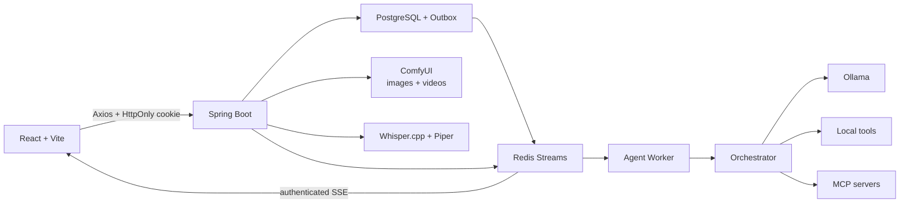
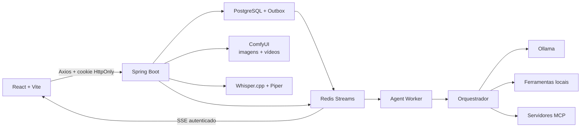

<p align="center">
  
</p>

<h1 align="center">Avento AI · Avento IA</h1>

<p align="center">
  A local-first assistant that understands projects, uses tools, and works with you on your own machine.<br>
  Um assistente local-first que entende projetos, usa ferramentas e trabalha com você no seu computador.
</p>

<p align="center"><strong>📖 Choose your language · Escolha o idioma</strong></p>

<details open>
<summary><strong>🇺🇸 English</strong></summary>

<p align="center">
  
</p>

<h1 align="center">Avento AI</h1>

<p align="center">
  A local-first assistant that understands projects, uses tools, and works with you on your own machine.
</p>

<p align="center">
  <strong>Java 21</strong> · <strong>React 19</strong> · <strong>Ollama</strong> · <strong>MCP</strong> · <strong>ComfyUI</strong> · <strong>Whisper.cpp</strong>
</p>

> [!IMPORTANT]
> Avento is under active development and is meant for local use on macOS. The backend, frontend, models, and tools listen only on loopback by default. Review the security section before allowing remote access.

## Overview

Avento brings together, in a single interface, a chat with local models and an agent able to inspect projects, ask for permission, run tools, and verify the result. The goal is not just to answer questions: it is to follow real tasks through without shipping your project's code to a mandatory API.

| Projects and code | Agent and automation | Multimodal and knowledge |
|---|---|---|
| Authorized workspaces | Orchestrator with an execution loop | Document reading with MarkItDown |
| File read, search, and edit | Visual and voice Permission Engine | Incremental RAG with Redis Vector Store |
| Diff, backup, and restore | Local tools and MCP servers | Vision with compatible Ollama models |
| Controlled terminal | macOS and browser automation | Image and video generation via ComfyUI |
| Project database discovery | Built-in and custom skills | STT with Whisper.cpp and TTS with Piper |
| Interactive HTML prototypes | Review on desktop, tablet, and phone | Implementation only after approval |

### What already works

- Persisted conversations, isolated per user.
- Asynchronous agent execution with PostgreSQL, Outbox, Redis Streams, a worker, and authenticated SSE.
- Idempotent execution and approval: duplicate Redis entries never repeat tools or re-present decisions that were already resolved.
- An activity watchdog ends silent runs without leaving the chat or the single local worker stuck indefinitely.
- Recent context is cached in Redis and rebuildable; PostgreSQL remains the durable source of truth.
- Per-conversation isolated, recoverable streaming: switching chats or reloading the page restores processing from the run's durable state, without moving Thinking, response, media, or voice into another conversation.
- Reasoning from hybrid models (qwen3, etc.) is routed explicitly to the interface's Thinking block instead of relying on Ollama's default; the model stays loaded between messages to cut reload latency.
- A per-run context window with a predictable ceiling: the compacted tool history stays bounded regardless of how many rounds the task takes, avoiding blowing past the model's `num_ctx` on long analyses.
- A failure to load history when switching chats shows an explicit notice with automatic retry instead of rendering the conversation as empty; the messages remain intact in PostgreSQL.
- The task panel opens once when a plan appears and respects a manual close for the rest of the execution.
- Chat model and visual-generation model selection in the header.
- Analysis of stack, scripts, entrypoints, and workspace structure.
- Read, create, edit, search, and delete of authorized files.
- Direct attachment of PDF, Office, EPUB, ZIP, text, and code in the chat, with local extraction via plain text or MarkItDown and context persisted in the conversation.
- Action approval through the interface or by voice commands.
- MCP integration with Git, databases, Docker, filesystem, browser, and macOS.
- Querying the database discovered in the active project, including inside Docker.
- Asynchronous image generation via ComfyUI with RealVisXL SDXL, structural or identity reference, pose control, visual review, progress, estimate, cancellation, and parameters adjustable in the frontend.
- Automatic translation of the prompt to English before SDXL (CLIP only understands English) and per-model generation presets (sampler, steps, CFG, and resolution tuned to each checkpoint), overridable by a local file without recompiling.
- Video generation via ComfyUI with WAN 2.2 TI2V, animation of the most recent image in the chat, background execution, progress, estimate, and cancellation.
- Media returned inside the chat, with controls to minimize, expand, and copy; the side section is also collapsible and uses a compact per-conversation list. Each file is linked to the conversation in PostgreSQL and is deleted from disk along with the chat.
- Markdown tables, visual reports and inline SVG charts rendered in the chat (GFM and `ui-preview` blocks).
- PDF export from Markdown or HTML, linked to the conversation (`generate_pdf` tool).
- Internet research synthesized into a table or report with cited sources (`/research` skill).
- Voice transcription and synthesis with configurable support for Portuguese, English, and Spanish.
- Permanent deletion of chats, messages, and related generated artifacts.

## Ready-Made Skills

Type `/skills` in the chat to list the available procedures. Skills with triggers also activate by natural language. A skill can declare `Ferramenta:` in its header: in that case the corresponding tool is exposed to the model with priority during selection (immune to the keyword heuristics), guaranteeing, for example, that `/generate-video` reaches `generate_video` and not `generate_image`. A skill always goes through the model, which reasons and decides the call.

| Skill | Purpose |
|---|---|
| `/analyze-project` | Inspect structure, manifests, code, and risks without changing files |
| `/fix-project` | Investigate, edit, and validate a requested fix |
| `/diagnose-project` | Reproduce failures and analyze logs, build, or tests |
| `/run-project` | Discover scripts, start processes, and confirm logs/ports |
| `/create-vite-project` and `/nestjs-project` | Create scaffolds using the official tools |
| `/read-document` | Read PDF, Office, EPUB, ZIP, OCR, audio, and text with MarkItDown |
| `/translate-content` | Faithfully translate provided text, preserving tone and explicit language without editorial censorship |
| `/inspect-database` | Discover the DBHub, inspect the schema, and run controlled queries |
| `/java-project-maintenance` | Apply DTOs, Lombok, layers, SOLID, and Clean Code in Java/Spring projects |
| `/spring-security-maintenance` and `/database-migration` | Maintain JWT/cookie auth, ownership, schema, and Flyway with security and data tests |
| `/async-execution-diagnostics` | Trace a `runId` through PostgreSQL, outbox, Redis Streams, worker, and SSE when the chat keeps thinking |
| `/mcp-integration-maintenance` | Maintain lifecycle, contracts, scopes, permissions, and real verification of MCP servers |
| `/avento-frontend-maintenance` | Fix React, responsiveness, streaming, and per-chat/run isolated state |
| `/prototype-interface` | Design and review a local HTML screen before changing the workspace |
| `/media-pipeline-maintenance` and `/voice-pipeline-maintenance` | Diagnose ComfyUI, Whisper, Piper, jobs, preview, and local playback |
| `/rag-knowledge-maintenance` | Maintain ingestion, chunking, embeddings, Redis Vector Store, and source-backed answers |
| `/dependency-modernization` | Update dependencies in compatible groups with evidence and incremental validation |
| `/avento-finalize-change` and `/release-readiness` | Close changes with docs/commit and run the full gate before publishing |
| `/manage-mcp` and `/web-research` | Connect MCP capabilities and research with real evidence |
| `/git-workflow` and `/docker-workflow` | Review Git and operate services/containers with real confirmation |
| `/manage-memory` | Store, query, and remove knowledge from local memory |
| `/generate-image` and `/generate-video` | Run the local visual pipelines with the frontend options |
| `/mac-workflow` | Coordinate apps, tabs, Finder, shortcuts, and capture on macOS |

Built-in skills live in `back/avento/src/main/resources/agent/skills/`. Skills created through the interface are personal, live in `data/skills/`, and take priority without changing the source code.

The policies versioned in `back/avento/src/main/resources/agent/policies/` are the project's public configuration. A machine may keep a personal policy in `~/.avento/policies/{mode}.md`; when that file exists, the backend uses it instead of the built-in policy without including its content in Git. The instructions consumed by the model are written in English to improve adherence on local models; the interface and the responses stay in the user's language.

For agents working on the repository itself, `AGENTS.md` points to the skills versioned in `.agents/skills/`. They cover the Java standard as well as security, database, MCP, async execution, frontend, media, voice, RAG, dependencies, finalization, and release.

## Brand and Logo

<p align="center">
  
</p>

Avento's identity represents an assistant that turns context into action while keeping the user in control:

- the **geometric A** identifies the brand and suggests forward motion;
- the **two slanted planes** represent movement and construction;
- the **central path** represents the flow between conversation, local model, Permission Engine, and MCP tools;
- the **pink node** represents a concrete, approved, and verifiable action;
- the **deep green**, the **mint**, and the **pink** balance trust, technology, and action.

The official files are [`avento-logo.svg`](front/src/assets/avento-logo.svg) and [`favicon.svg`](front/public/favicon.svg). See the [visual identity guide](docs/BRAND.md) for palette, sizes, and usage rules.

## Architecture



The frontend never receives the authentication token. The backend concentrates session, workspace authorization, persistence, model calls, and tool execution. Actions with an effect on the computer pass through the Permission Engine before reaching the local or MCP provider. MCP clients, permissions, approvals, processes, and timeline are isolated per user and chat.

The JSON REST routes use a single contract:

```json
{
  "status": 200,
  "code": "SUCCESS",
  "data": { "id": 7, "title": "My chat" }
}
```

`status` echoes the HTTP status, `code` is stable for automation, and `data` holds the result. Empty collections return `data: []`. On failures, `data` holds `message`, `path`, `timestamp`, `traceId`, and any field errors. SSE, audio, and downloads keep the native formats of their respective protocols. The shared Axios client unwraps JSON responses to preserve the types used by the interface.

More detail: [current architecture](docs/ARCHITECTURE.md) and [agent and MCP orchestration](docs/ORCHESTRATION.md). The flow of jobs, context, and events is explained step by step in [async execution with Redis](docs/REDIS_EXECUTION.md).

## Structure

```text
avento-ia/
├── front/                     # React, TypeScript, Vite, and styled-components
├── back/
│   ├── avento/                # Spring Boot, Maven resources and tests
│   └── whisper.cpp/           # Local runtime; not versioned
├── piper_tts/                 # Local runtime and voices; not versioned
├── .avento-tools/             # MarkItDown and local MCP tools
├── scripts/                   # Setup, startup, and smoke tests
├── docs/                      # Technical and operational guides
├── docker-compose.yml         # PostgreSQL and Redis Stack
├── .env.example               # Safe configuration example
└── .env                       # Local configuration; not versioned
```

## Requirements

### Required

- Java 21
- Maven
- Node.js, npm, and npx
- Docker Desktop, Docker Engine, or Colima
- Ollama

### Recommended

- FFmpeg for the audio pipeline
- Python 3 for ComfyUI, Piper, and helper tools
- CMake to build or update Whisper.cpp

Check the environment:

```bash
./scripts/check-local-deps.sh
```

## Quick Start

### 1. Configure the environment

```bash
cp .env.example .env
```

Set `AVENTO_AUTH_ROOT_PASSWORD` in `.env`. If it is empty, the development script generates a random password and saves it only in the local file ignored by Git.

### 2. Local models

```bash
ollama pull qwen3:8b
ollama pull llama3.2
ollama pull nomic-embed-text
```

### 3. Start Avento

In another terminal:

```bash
./scripts/dev-up.sh
```

The script prepares and connects the local MCP tools, starts PostgreSQL, Redis, and Ollama, installs or starts ComfyUI, resolves dependencies, brings up the backend and frontend, and runs an authenticated smoke test. If Ollama is already running, the existing instance is reused.

At the end, it prints the URLs used. The default values are:

| Service | URL |
|---|---|
| Frontend | `http://127.0.0.1:5173` |
| Backend | `http://127.0.0.1:8000` |
| ComfyUI | `http://127.0.0.1:8188` |
| Ollama | `http://127.0.0.1:11434` |

Logs live in `tmp/dev/` and are also streamed live to the script's terminal. Each agent round logs start, completion, or failure; ComfyUI generations log enqueue, progress every 10 seconds, and the finished file path. The local root login is printed before and after startup. Use `Ctrl+C` to stop the processes started by the script.

## Manual Run

```bash
# PostgreSQL and Redis Stack, with migration of legacy containers
./scripts/prepare-docker-stack.sh

# Backend, run from the repository root
mvn -f back/avento/pom.xml spring-boot:run \
  -Dspring-boot.run.profiles=local

# Frontend
npm --prefix front install
npm --prefix front run dev
```

The backend must be started from the root to find `.env`, `.avento-tools`, `back/whisper.cpp`, `piper_tts`, and the temporary directories.

## Local Models and Services

### Chat and RAG

| Use | Recommendation |
|---|---|
| Agent with tools | `qwen3:8b` |
| Lightweight text fallback | `llama3.2` |
| Embeddings | `nomic-embed-text` |
| Image reading | `llama3.2-vision`, `llava`, or equivalent |

The model chosen in the interface travels with the request. `AVENTO_AGENT_DEFAULT_MODEL` is used only when no model is provided. The backend sends explicit inference parameters to Ollama (`temperature=0.15`, `top_p=0.9`, `top_k=30`, and `repeat_penalty=1.08` by default), all overridable via `AVENTO_AGENT_*` variables. Short continuations such as "continue" or "try again" receive the last substantive request in a continuity block to avoid a goal switch when the history is compacted.

### Image and video

**ComfyUI generates Avento's images and videos.** It is separate from the Ollama models: Ollama drives the conversation and can interpret images with a multimodal model, while ComfyUI runs the visual generation workflows and returns the files to the chat. Visual generation requires no workspace or MCP server. Explicit requests and standalone visual descriptions with enough style and composition signals are routed directly to `generate_image`; requests to analyze, explain, or improve a prompt stay in the conversation.

| Feature | Default provider and model | Result |
|---|---|---|
| Image | ComfyUI + RealVisXL V5 SDXL, Realistic Vision V6, or FLUX.2 Klein 4B | PNG shown in the chat and registered in the conversation gallery |
| Text-to-video | ComfyUI + WAN 2.2 TI2V 5B | Animated WebP created from the prompt |
| Image-to-video | ComfyUI + WAN 2.2 TI2V 5B | Animated WebP that keeps the most recent image as the first frame |

Avento detects the installed SD, SDXL checkpoints and FLUX.2 diffusion models, selects the correct workflow for each architecture, and keeps all of them in the image selector. The default is RealVisXL V5 at native SDXL resolution. Each checkpoint family uses its own preset (sampler, steps, CFG, and native resolution per quality level), defined in `comfyui/model-presets.json` and overridable via `~/.avento/image-presets.json` without recompiling. The preset also declares the encoder's prompt style: `tags` for SDXL/SD 1.5 receives the planner's reinforced prompt, while `natural` for FLUX.2 Klein (whose encoder is an LLM) receives the translated request as a sentence — FLUX.2 models treat keyword soup as noise. Before SDXL, the request is translated to English because CLIP does not understand Portuguese. The header menu offers quality, primary subject, aspect ratio, subject count, CFG, second pass, detailers, pose reference, prompt enhancement, seed, and three distinct uses for the last attached image: `Composition` preserves depth or contours with ControlNet, `Identity` uses IP-Adapter, and `Transform` runs img2img. These choices take precedence over arguments suggested by the model.

`Validate result` unloads the generation checkpoint, asks the local vision model to compare the image to the request, and can regenerate with an objective correction. The configurable limit is zero to two extra attempts; each attempt increases the total time. The review does not replace the structural controls and does not make a diffusion model mathematically deterministic: it reduces divergent results and, if the vision model is unavailable, preserves the already generated image instead of blocking delivery.

The setup installs the ComfyUI runtime in `~/ComfyUI`. `scripts/setup-comfyui-sdxl.sh` prepares RealVisXL V5, the SDXL VAE, ControlNet OpenPose/Canny/Depth, IP-Adapter, and Depth Anything, at roughly 19 GB. `scripts/setup-comfyui-image.sh` maintains the legacy SD 1.5 pipeline with Realistic Vision V6, and `scripts/setup-comfyui-flux2.sh` installs FLUX.2 Klein 4B. All downloads are resumable and verified by SHA-256. The SDXL install can be disabled with `AVENTO_COMFYUI_SDXL_AUTO_INSTALL=0`; the default model, the adherence threshold, and the workflow can be overridden via `AVENTO_COMFYUI_DEFAULT_MODEL`, `AVENTO_COMFYUI_ADHERENCE_MIN_SCORE`, and `AVENTO_COMFYUI_SDXL_WORKFLOW`. WAN 2.2 TI2V 5B, its VAE, and the shared encoder are still installed for videos.

Image and video use jobs persisted in PostgreSQL and separate local workers, both limited to one generation at a time to respect the machine's memory. The agent call returns immediately; the chat shows the step, estimated progress, elapsed time, remaining forecast, and cancellation. On completion, the file is registered in the conversation, the side gallery is refreshed, and the media appears minimized in the balloon itself.

The video workflow lives in `back/avento/src/main/resources/comfyui/workflows/text-to-video-api.json`. It uses hybrid WAN 2.2: by default it animates the most recent image in the conversation; `mode=text` creates a video from scratch and `mode=image` requires a previous image. The backend validates the diffusion model, text encoder, and VAE before enqueueing the generation and saves the result as an animated WebP in `~/Pictures/Avento Generated Images`.

Jobs interrupted by a backend restart are resumed. When a chat is deleted, Avento cancels active image and video jobs and also removes their records and files linked to the conversation.

### Interface prototyping

Requests for `screen mockup`, `interface mockup`, `ui mockup`, `website mockup`, `wireframe`, or prototype activate `prototype-interface` before image routing. Avento returns self-contained HTML, CSS, and JavaScript in an interactive viewer in the chat, initially collapsed into a clickable thumbnail, with desktop, tablet, phone, and expand modes. This path does not call ComfyUI or create an image: the browser renders the artifact, which is persisted in the conversation's normal content. The document runs in an isolated iframe, without network and without access to Avento's session. After explicit user approval, the agent translates the proposal into the workspace's real components and can validate them with Playwright. See the [local prototyping guide](docs/INTERFACE_PROTOTYPING.md).

### Documents in the chat

The clip button in the composer accepts up to four documents per message, at a maximum of 50 MB per file. PDF, Word, Excel, PowerPoint, EPUB, ZIP, text files, and common code formats are accepted. The authenticated endpoint `POST /api/documents/extract` creates a temporary copy, extracts the content locally, and removes that copy when done. Plain text is read directly; the other formats use the MarkItDown installed by `scripts/setup-local-mcps.sh`. The relative path `.avento-tools/mcp` is always resolved from the Avento root, regardless of the directory used to start the backend.

To protect the local model's context window, each document contributes up to `AVENTO_DOCUMENT_ATTACHMENT_MAX_CONTEXT_CHARS` characters, 5,000 by default. The name and the extracted context are persisted in the message and reused when reopening the conversation; the original file stays only in the location chosen by the user.

### Voice

```text
microphone → WebM → FFmpeg → Whisper.cpp → text
text → Piper → WAV → browser
```

The voice control is global for the interface. When muting, Avento interrupts the current speech, drops the queue, and invalidates syntheses still in progress; new chunks cannot turn the audio back on. The choice is saved in the browser. When unmuting, only new phrases from the currently open chat can play.

Expected local files:

```text
back/whisper.cpp/build/bin/whisper-cli
back/whisper.cpp/models/ggml-small.bin
back/whisper.cpp/models/ggml-silero-v6.2.0.bin
piper_tts/.venv/bin/piper
piper_tts/pt_BR-dii-high.onnx
piper_tts/en_US-lessac-medium.onnx
```

## MCP and Permissions

The catalog uses the official MCP Java SDK 2.x, pinned versions of the npm servers, and an automatic set configurable via `AVENTO_MCP_AUTO_CONNECT`. Specialized tools can also be connected on demand. The available groups include:

- **core:** filesystem, MarkItDown, memory, sequential reasoning, and time;
- **developer:** Git and project tools;
- **data:** PostgreSQL and DBHub;
- **automation:** Desktop Commander, Apple MCP, and macOS automation;
- **web:** Playwright, Puppeteer, Chrome DevTools, Fetch, and SearXNG;
- **advanced:** Docker MCP Gateway.

Repeated connections are idempotent: an already active MCP is not restarted on every message. Desktop Commander remains available in the catalog but must be connected on demand because its startup can be slow on some machines. The SDK's default timeout is 10 seconds and can be changed via `AVENTO_MCP_SDK_REQUEST_TIMEOUT`.

Destructive or externally effective tools require approval. Temporary permissions are bound to the user, project, tool, resource, and duration; approvals can also be answered by voice.

See the [full MCP catalog](docs/LOCAL_MCP_CATALOG.md).

## Authentication and Data

- The access token stays in the `avento_access` cookie with `HttpOnly`.
- The frontend uses Axios with `withCredentials=true` and does not read the token.
- JSON REST responses follow `BaseResponse<T>`; the `ControllerAdvice` applies the same format to validation, authentication, and domain errors.
- Refresh is controlled by the backend and tied to the persisted session.
- PostgreSQL stores users, sessions, audit, chats, and messages.
- Redis Stack carries jobs and events and holds recent context, RAG vectors, and local caches.
- Generated images live, by default, in `~/Pictures/Avento Generated Images`.

Minimal example:

```env
AVENTO_AUTH_ROOT_EMAIL=admin@avento.local
AVENTO_AUTH_ROOT_PASSWORD=set-a-strong-password
AVENTO_AUTH_JWT_SECRET=change-this-secret-before-exposing-the-server
```

## Useful Commands

| Goal | Command |
|---|---|
| Check dependencies | `./scripts/check-local-deps.sh` |
| Start the environment | `./scripts/dev-up.sh` |
| Prepare only PostgreSQL and Redis | `./scripts/prepare-docker-stack.sh` |
| Test the backend | `mvn -f back/avento/pom.xml test` |
| Validate the frontend | `npm --prefix front run validate` |
| Validate scripts | `bash -n scripts/*.sh` |
| Validate the Compose file | `docker compose config --quiet` |
| List containers | `docker compose ps` |
| Smoke test | `AVENTO_SMOKE_PASSWORD='...' ./scripts/smoke-local.sh` |

## Security

Avento is local-first, but it performs real actions on the computer. Before allowing remote access:

1. use HTTPS;
2. enable `Secure` cookies;
3. change the JWT secret and all passwords;
4. restrict CORS and network interfaces;
5. review MCPs, workspaces, and granted permissions;
6. use a secrets manager.

`.env`, models, native runtimes, local databases, logs, dependencies, and builds stay out of Git.

## Documentation

| Guide | Content |
|---|---|
| [Current architecture](docs/ARCHITECTURE.md) | Diagram of components, flows, data, voice, media, and MCP |
| [Evolution plan](docs/IMPLEMENTATION_PLAN.md) | Future phases explained, acceptance criteria, and pending decisions |
| [Local setup](docs/SETUP.md) | Installation, services, voice, security, and diagnostics |
| [Orchestration](docs/ORCHESTRATION.md) | Agent loop, states, and MCP integration |
| [MCP catalog](docs/LOCAL_MCP_CATALOG.md) | Servers, profiles, project database, and configuration |
| [Interface prototyping](docs/INTERFACE_PROTOTYPING.md) | Local HTML preview, isolation, review, and approval before code |
| [Roadmap](docs/AGENT_ROADMAP.md) | Planned agent evolution |
| [Visual identity](docs/BRAND.md) | Logo, palette, and brand guidelines |
| [Contributing](CONTRIBUTING.md) | Code standards and validations |

## Current Limitations

- The development flow is primarily targeted at macOS.
- Ollama models, ComfyUI checkpoints, and Piper voices are not distributed in the repository.
- The main frontend bundle may still emit a size warning during the build.
- The default configuration should not be exposed directly to the internet.

---

<p align="center">
  <strong>Avento AI</strong><br>
  Local code, real tools, and decisions under your control.
</p>

</details>

<details>
<summary><strong>🇧🇷 Português</strong></summary>

<p align="center">
  
</p>

<h1 align="center">Avento IA</h1>

<p align="center">
  Um assistente local-first que entende projetos, usa ferramentas e trabalha com você no seu computador.
</p>

<p align="center">
  <strong>Java 21</strong> · <strong>React 19</strong> · <strong>Ollama</strong> · <strong>MCP</strong> · <strong>ComfyUI</strong> · <strong>Whisper.cpp</strong>
</p>

> [!IMPORTANT]
> O Avento está em desenvolvimento ativo e foi preparado para uso local no macOS. Backend, frontend, modelos e ferramentas escutam apenas em loopback por padrão. Revise a seção de segurança antes de permitir acesso remoto.

## Visão Geral

O Avento reúne, em uma única interface, um chat com modelos locais e um agente capaz de inspecionar projetos, pedir permissão, executar ferramentas e verificar o resultado. O objetivo não é apenas responder perguntas: é acompanhar tarefas reais sem enviar o código do projeto para uma API obrigatória.

| Projetos e código | Agente e automação | Multimodal e conhecimento |
|---|---|---|
| Workspaces autorizados | Orquestrador com ciclo de execução | Leitura de documentos com MarkItDown |
| Leitura, busca e edição de arquivos | Permission Engine visual e por voz | RAG incremental com Redis Vector Store |
| Diff, backup e restauração | Ferramentas locais e servidores MCP | Visão com modelos Ollama compatíveis |
| Terminal controlado | Automação de macOS e navegador | Geração de imagens e vídeos pelo ComfyUI |
| Descoberta de bancos do projeto | Skills internas e personalizadas | STT com Whisper.cpp e TTS com Piper |
| Protótipos HTML interativos | Revisão em desktop, tablet e celular | Implementação somente após aprovação |

### O que já funciona

- Conversas persistidas e isoladas por usuário.
- Execução assíncrona do agente com PostgreSQL, Outbox, Redis Streams, worker e SSE autenticado.
- Execução e aprovação idempotentes: entradas Redis duplicadas não repetem ferramentas nem reapresentam decisões já resolvidas.
- Watchdog de atividade encerra runs silenciosos sem deixar o chat ou o único worker local presos indefinidamente.
- Contexto recente em cache Redis reconstruível; PostgreSQL continua sendo a fonte durável.
- Streaming isolado e recuperavel por conversa: trocar de chat ou recarregar a pagina restaura o processamento pelo estado duravel do run, sem mover Thinking, resposta, midia ou voz para outra conversa.
- Raciocinio de modelos hibridos (qwen3, etc.) roteado de forma explicita para o bloco de Thinking da interface, sem depender do default do Ollama; o modelo permanece carregado entre mensagens para reduzir latencia de recarga.
- Janela de contexto por execucao com teto previsivel: o historico compactado de ferramentas fica limitado independente de quantas rodadas a tarefa tiver, evitando estourar o `num_ctx` do modelo em analises longas.
- Falha ao carregar o historico na troca de chat mostra um aviso explicito com nova tentativa automatica, em vez de renderizar a conversa como vazia; as mensagens permanecem integras no PostgreSQL.
- O painel de tarefas abre uma vez quando surge um plano e respeita o fechamento manual durante o restante da execucao.
- Seleção de modelo de chat e de geração visual no header.
- Análise de stack, scripts, entrypoints e estrutura do workspace.
- Leitura, criação, edição, busca e exclusão de arquivos autorizados.
- Anexo direto de PDF, Office, EPUB, ZIP, texto e código no chat, com extração local por texto puro ou MarkItDown e contexto persistido na conversa.
- Aprovação de ações pela interface ou por comandos de voz.
- Integração MCP com Git, bancos, Docker, filesystem, navegador e macOS.
- Consulta ao banco descoberto no projeto ativo, inclusive em Docker.
- Geração assíncrona de imagens pelo ComfyUI com RealVisXL SDXL, referência estrutural ou de identidade, controle de pose, revisão visual, progresso, estimativa, cancelamento e parâmetros ajustáveis no frontend.
- Tradução automática do prompt para inglês antes do SDXL (o CLIP só entende inglês) e presets de geração por modelo (sampler, passos, CFG e resolução ajustados a cada checkpoint), sobreponíveis por um arquivo local sem recompilar.
- Geração de vídeos pelo ComfyUI com WAN 2.2 TI2V, animação da imagem mais recente do chat, execução em background, progresso, estimativa e cancelamento.
- Retorno das mídias dentro do chat, com controles para minimizar, expandir e copiar; a seção lateral também é recolhível e usa uma lista compacta por conversa. Cada arquivo fica vinculado à conversa no PostgreSQL e é apagado do disco junto com o chat.
- Tabelas Markdown, relatórios visuais e gráficos SVG renderizados no chat (GFM e blocos `ui-preview`).
- Exportação de PDF a partir de Markdown ou HTML, vinculada à conversa (ferramenta `generate_pdf`).
- Pesquisa na internet com síntese em tabela ou relatório e citação de fontes (skill `/research`).
- Transcrição e síntese de voz com suporte configurável a português, inglês e espanhol.
- Exclusão permanente de chats, mensagens e artefatos gerados relacionados.

## Skills Prontas

Digite `/skills` no chat para listar os procedimentos disponíveis. Skills com gatilhos também
ativam por linguagem natural. Uma skill pode declarar `Ferramenta:` no cabeçalho: nesse caso a
ferramenta correspondente é exposta ao modelo com prioridade na seleção (imune às heurísticas de
palavra-chave), garantindo, por exemplo, que `/generate-video` chegue ao `generate_video` e não ao
`generate_image`. A skill sempre passa pelo modelo, que raciocina e decide a chamada.

| Skill | Finalidade |
|---|---|
| `/analyze-project` | Inspecionar estrutura, manifests, código e riscos sem alterar arquivos |
| `/fix-project` | Investigar, editar e validar uma correção solicitada |
| `/diagnose-project` | Reproduzir falhas e analisar logs, build ou testes |
| `/run-project` | Descobrir scripts, iniciar processos e confirmar logs/portas |
| `/create-vite-project` e `/nestjs-project` | Criar scaffolds usando as ferramentas oficiais |
| `/read-document` | Ler PDF, Office, EPUB, ZIP, OCR, áudio e texto com MarkItDown |
| `/translate-content` | Traduzir fielmente texto fornecido, preservando tom e linguagem explícita sem censura editorial |
| `/inspect-database` | Descobrir o DBHub, inspecionar esquema e executar consultas controladas |
| `/java-project-maintenance` | Aplicar DTOs, Lombok, camadas, SOLID e Clean Code em projetos Java/Spring |
| `/spring-security-maintenance` e `/database-migration` | Manter autenticação JWT/cookie, ownership, schema e Flyway com testes de segurança e dados |
| `/async-execution-diagnostics` | Rastrear um `runId` por PostgreSQL, outbox, Redis Streams, worker e SSE quando o chat fica pensando |
| `/mcp-integration-maintenance` | Manter lifecycle, contratos, escopos, permissões e verificação real de servidores MCP |
| `/avento-frontend-maintenance` | Corrigir React, responsividade, streaming e estado isolado por chat/run |
| `/prototype-interface` | Desenhar e revisar uma tela HTML local antes de alterar o workspace |
| `/media-pipeline-maintenance` e `/voice-pipeline-maintenance` | Diagnosticar ComfyUI, Whisper, Piper, jobs, preview e playback local |
| `/rag-knowledge-maintenance` | Manter ingestão, chunking, embeddings, Redis Vector Store e respostas apoiadas em fontes |
| `/dependency-modernization` | Atualizar dependências em grupos compatíveis com evidência e validação incremental |
| `/avento-finalize-change` e `/release-readiness` | Fechar mudanças com docs/commit e executar o gate completo antes de publicar |
| `/manage-mcp` e `/web-research` | Conectar capacidades MCP e pesquisar com evidências reais |
| `/git-workflow` e `/docker-workflow` | Revisar Git e operar serviços/containers com confirmação real |
| `/manage-memory` | Guardar, consultar e remover conhecimento da memória local |
| `/generate-image` e `/generate-video` | Executar os pipelines visuais locais com as opções do frontend |
| `/mac-workflow` | Coordenar apps, abas, Finder, atalhos e captura no macOS |

As skills embutidas ficam em `back/avento/src/main/resources/agent/skills/`. Skills criadas pela
interface são pessoais, ficam em `data/skills/` e têm prioridade sem alterar o código-fonte.

As políticas versionadas em `back/avento/src/main/resources/agent/policies/` são a configuração
pública do projeto. Uma máquina pode manter uma política pessoal em
`~/.avento/policies/{modo}.md`; quando esse arquivo existe, o backend o usa no lugar da política
embutida sem incluir seu conteúdo no Git. As instruções consumidas pelo modelo são escritas em
inglês para melhorar aderência em modelos locais; a interface e as respostas continuam no idioma do
usuário.

Para agentes que trabalham no próprio repositório, `AGENTS.md` aponta para as skills versionadas em
`.agents/skills/`. Elas cobrem o padrão Java e também segurança, banco, MCP, execução assíncrona,
frontend, mídia, voz, RAG, dependências, finalização e release.

## Marca e Logo

<p align="center">
  
</p>

A identidade do Avento representa um assistente que transforma contexto em ação mantendo o usuário no controle:

- o **A geométrico** identifica a marca e sugere avanço;
- os **dois planos inclinados** representam movimento e construção;
- o **caminho central** representa o fluxo entre conversa, modelo local, Permission Engine e ferramentas MCP;
- o **nó rosa** representa uma ação concreta, aprovada e verificável;
- o **verde profundo**, a **menta** e o **rosa** equilibram confiança, tecnologia e ação.

Os arquivos oficiais são [`avento-logo.svg`](front/src/assets/avento-logo.svg) e [`favicon.svg`](front/public/favicon.svg). Consulte o [guia de identidade visual](docs/BRAND.md) para paleta, tamanhos e regras de uso.

## Arquitetura



O frontend nunca recebe o token de autenticação. O backend concentra sessão, autorização de workspaces, persistência, chamadas aos modelos e execução de ferramentas. Ações com efeito no computador passam pelo Permission Engine antes de chegar ao provider local ou MCP. Clientes MCP, permissões, aprovações, processos e timeline são isolados por usuário e chat.

As rotas REST JSON usam um contrato único:

```json
{
  "status": 200,
  "code": "SUCCESS",
  "data": { "id": 7, "title": "Meu chat" }
}
```

`status` repete o status HTTP, `code` é estável para automação e `data` contém o resultado. Coleções sem itens retornam `data: []`. Em falhas, `data` contém `message`, `path`, `timestamp`, `traceId` e eventuais erros de campo. SSE, áudio e downloads permanecem nos formatos nativos dos respectivos protocolos. O client Axios compartilhado desembrulha respostas JSON para preservar os tipos usados pela interface.

Mais detalhes: [arquitetura atual](docs/ARCHITECTURE.md) e
[orquestração do agente e MCP](docs/ORCHESTRATION.md). O fluxo de jobs, contexto e eventos está
explicado passo a passo em [execução assíncrona com Redis](docs/REDIS_EXECUTION.md).

## Estrutura

```text
avento-ia/
├── front/                     # React, TypeScript, Vite e styled-components
├── back/
│   ├── avento/                # Spring Boot, recursos e testes Maven
│   └── whisper.cpp/           # Runtime local; não é versionado
├── piper_tts/                 # Runtime e vozes locais; não é versionado
├── .avento-tools/             # MarkItDown e ferramentas MCP locais
├── scripts/                   # Setup, inicialização e smoke tests
├── docs/                      # Guias técnicos e operacionais
├── docker-compose.yml         # PostgreSQL e Redis Stack
├── .env.example               # Exemplo seguro de configuração
└── .env                       # Configuração local; não é versionada
```

## Requisitos

### Obrigatórios

- Java 21
- Maven
- Node.js, npm e npx
- Docker Desktop, Docker Engine ou Colima
- Ollama

### Recomendados

- FFmpeg para o pipeline de áudio
- Python 3 para ComfyUI, Piper e ferramentas auxiliares
- CMake para compilar ou atualizar o Whisper.cpp

Confira o ambiente:

```bash
./scripts/check-local-deps.sh
```

## Início Rápido

### 1. Configure o ambiente

```bash
cp .env.example .env
```

Defina `AVENTO_AUTH_ROOT_PASSWORD` no `.env`. Se ela estiver vazia, o script de desenvolvimento gera uma senha aleatória e salva apenas no arquivo local ignorado pelo Git.

### 2. Modelos locais

```bash
ollama pull qwen3:8b
ollama pull llama3.2
ollama pull nomic-embed-text
```

### 3. Suba o Avento

Em outro terminal:

```bash
./scripts/dev-up.sh
```

O script prepara e conecta as ferramentas MCP locais, inicia PostgreSQL, Redis e Ollama, instala ou inicia o ComfyUI, resolve dependências, sobe backend e frontend e executa um smoke test autenticado. Se o Ollama já estiver rodando, a instância existente é reutilizada.

Ao final, ele imprime as URLs utilizadas. Os valores padrão são:

| Serviço | URL |
|---|---|
| Frontend | `http://127.0.0.1:5173` |
| Backend | `http://127.0.0.1:8000` |
| ComfyUI | `http://127.0.0.1:8188` |
| Ollama | `http://127.0.0.1:11434` |

Os logs ficam em `tmp/dev/` e tambem sao transmitidos ao vivo no terminal do script. Cada rodada do agente registra inicio, conclusao ou falha; geracoes do ComfyUI registram enfileiramento, progresso a cada 10 segundos e caminho do arquivo concluido. O login root local aparece antes e depois da inicializacao. Use `Ctrl+C` para encerrar os processos iniciados pelo script.

## Execução Manual

```bash
# PostgreSQL e Redis Stack, com migracao de containers legados
./scripts/prepare-docker-stack.sh

# Backend, executado a partir da raiz
mvn -f back/avento/pom.xml spring-boot:run \
  -Dspring-boot.run.profiles=local

# Frontend
npm --prefix front install
npm --prefix front run dev
```

O backend deve ser iniciado a partir da raiz para encontrar `.env`, `.avento-tools`, `back/whisper.cpp`, `piper_tts` e os diretórios temporários.

## Modelos e Serviços Locais

### Chat e RAG

| Uso | Recomendação |
|---|---|
| Agente com ferramentas | `qwen3:8b` |
| Fallback textual leve | `llama3.2` |
| Embeddings | `nomic-embed-text` |
| Leitura de imagem | `llama3.2-vision`, `llava` ou equivalente |

O modelo escolhido na interface acompanha a requisição. `AVENTO_AGENT_DEFAULT_MODEL` é usado apenas quando nenhum modelo foi informado. O backend envia ao Ollama parâmetros explícitos de inferência (`temperature=0.15`, `top_p=0.9`, `top_k=30` e `repeat_penalty=1.08` por padrão), todos substituíveis por variáveis `AVENTO_AGENT_*`. Continuações curtas como "continue" ou "tenta de novo" recebem o último pedido substantivo em um bloco de continuidade para evitar troca de objetivo quando o histórico é compactado.

### Imagem e vídeo

O **ComfyUI gera as imagens e os vídeos do Avento**. Ele é separado dos modelos Ollama: o Ollama conduz a conversa e pode interpretar imagens com um modelo multimodal, enquanto o ComfyUI executa os workflows de geração visual e devolve os arquivos para o chat. Geração visual não exige workspace nem servidor MCP. Pedidos explícitos e descrições visuais autônomas com sinais suficientes de estilo e composição são encaminhados diretamente para `generate_image`; pedidos para analisar, explicar ou melhorar um prompt permanecem na conversa.

| Recurso | Provider e modelo padrão | Resultado |
|---|---|---|
| Imagem | ComfyUI + RealVisXL V5 SDXL, Realistic Vision V6 ou FLUX.2 Klein 4B | PNG exibido no chat e registrado na galeria da conversa |
| Vídeo por texto | ComfyUI + WAN 2.2 TI2V 5B | WebP animado criado a partir do prompt |
| Vídeo por imagem | ComfyUI + WAN 2.2 TI2V 5B | WebP animado que preserva a imagem mais recente como quadro inicial |

O Avento detecta os checkpoints SD, SDXL e os diffusion models FLUX.2 instalados, seleciona o workflow correto para cada arquitetura e mantém todos no seletor de imagem. O padrão é o RealVisXL V5 em resolução SDXL nativa. Cada família de checkpoint usa um preset próprio (sampler, passos, CFG e resolução nativa por nível de qualidade), definido em `comfyui/model-presets.json` e sobreponível por `~/.avento/image-presets.json` sem recompilar. O preset também declara o estilo de prompt do encoder: `tags` para SDXL/SD 1.5 recebe o prompt reforçado do planner, enquanto `natural` para o FLUX.2 Klein (cujo encoder é um LLM) recebe o pedido traduzido como frase — os modelos FLUX.2 tratam sopa de palavra-chave como ruído. Antes do SDXL, o pedido é traduzido para inglês porque o CLIP não entende português. O menu do header oferece qualidade, assunto principal, proporção, quantidade de sujeitos, CFG, segundo passe, detailers, referência de pose, melhoria de prompt, seed e três usos distintos para a última imagem anexada: `Composição` preserva profundidade ou contornos com ControlNet, `Identidade` usa IP-Adapter e `Transformação` executa img2img. Essas escolhas prevalecem sobre argumentos sugeridos pelo modelo.

`Validar resultado` descarrega o checkpoint de geração, pede ao modelo visual local que compare a imagem ao pedido e pode refazer a geração com uma correção objetiva. O limite configurável é de zero a duas tentativas extras; cada tentativa aumenta o tempo total. A revisão não substitui os controles estruturais e não torna um modelo de difusão matematicamente determinístico: ela reduz resultados divergentes e, se o modelo visual estiver indisponível, preserva a imagem já gerada em vez de bloquear a entrega.

O setup instala o runtime do ComfyUI em `~/ComfyUI`. `scripts/setup-comfyui-sdxl.sh` prepara o RealVisXL V5, VAE SDXL, ControlNet OpenPose/Canny/Depth, IP-Adapter e Depth Anything, em aproximadamente 19 GB. `scripts/setup-comfyui-image.sh` mantém o pipeline SD 1.5 legado com Realistic Vision V6, e `scripts/setup-comfyui-flux2.sh` instala o FLUX.2 Klein 4B. Todos os downloads são retomáveis e verificados por SHA-256. A instalação SDXL pode ser desabilitada com `AVENTO_COMFYUI_SDXL_AUTO_INSTALL=0`; o modelo padrão, o limite de aderência e o workflow podem ser substituídos por `AVENTO_COMFYUI_DEFAULT_MODEL`, `AVENTO_COMFYUI_ADHERENCE_MIN_SCORE` e `AVENTO_COMFYUI_SDXL_WORKFLOW`. O WAN 2.2 TI2V 5B, seu VAE e o encoder compartilhado continuam sendo instalados para vídeos.

Imagem e vídeo usam jobs persistidos no PostgreSQL e workers locais separados, ambos limitados a uma geração por vez para respeitar a memória da máquina. A chamada do agente retorna imediatamente; o chat mostra etapa, progresso estimado, tempo decorrido, previsão restante e cancelamento. Ao concluir, o arquivo é registrado na conversa, a galeria lateral é atualizada e a mídia aparece minimizada no próprio balão.

O workflow de vídeo fica em `back/avento/src/main/resources/comfyui/workflows/text-to-video-api.json`. Ele usa o WAN 2.2 híbrido: por padrão, anima a imagem mais recente da conversa; `mode=text` cria um vídeo do zero e `mode=image` exige uma imagem anterior. O backend valida diffusion model, text encoder e VAE antes de enfileirar a geração e salva o resultado como WebP animado em `~/Pictures/Avento Generated Images`.

Jobs interrompidos por uma reinicialização do backend são retomados. Ao apagar um chat, o Avento cancela jobs ativos de imagem e vídeo e remove também seus registros e arquivos vinculados à conversa.

### Prototipação de interfaces

Pedidos de `mockup de tela`, `mockup de interface`, `ui mockup`, `website mockup`, `wireframe` ou
protótipo ativam `prototype-interface` antes do roteamento de imagens. O Avento devolve HTML, CSS e
JavaScript autocontidos em um visualizador interativo no chat, inicialmente recolhido em uma
miniatura clicável, com modos desktop, tablet, celular e expansão. Esse caminho não chama o ComfyUI
nem cria uma imagem: o navegador renderiza o artefato, que fica persistido no conteúdo normal da
conversa. O documento roda em um iframe isolado, sem rede e sem acesso à sessão do Avento. Depois da
aprovação explícita do usuário, o agente traduz a proposta para os componentes reais do workspace e
pode validá-los com Playwright. Veja o
[guia de prototipação local](docs/INTERFACE_PROTOTYPING.md).

### Documentos no chat

O botão de clipe no composer aceita até quatro documentos por mensagem, com no máximo 50 MB por arquivo. São aceitos PDF, Word, Excel, PowerPoint, EPUB, ZIP, arquivos de texto e formatos comuns de código. O endpoint autenticado `POST /api/documents/extract` cria uma cópia temporária, extrai o conteúdo localmente e remove essa cópia ao terminar. Texto simples é lido diretamente; os demais formatos usam o MarkItDown instalado por `scripts/setup-local-mcps.sh`. O caminho relativo `.avento-tools/mcp` é sempre resolvido a partir da raiz do Avento, independentemente do diretório usado para iniciar o Back.

Para proteger a janela de contexto do modelo local, cada documento contribui com até `AVENTO_DOCUMENT_ATTACHMENT_MAX_CONTEXT_CHARS` caracteres, 5.000 por padrão. O nome e o contexto extraído ficam persistidos na mensagem e voltam a ser usados ao reabrir a conversa; o arquivo original permanece somente no local escolhido pelo usuário.

### Voz

```text
microfone → WebM → FFmpeg → Whisper.cpp → texto
texto → Piper → WAV → navegador
```

O controle de voz e global para a interface. Ao mutar, o Avento interrompe a fala atual, descarta a
fila e invalida sinteses ainda em andamento; novos chunks nao conseguem religar o audio. A escolha
fica salva no navegador. Ao desmutar, somente novas frases do chat atualmente aberto podem tocar.

Arquivos locais esperados:

```text
back/whisper.cpp/build/bin/whisper-cli
back/whisper.cpp/models/ggml-small.bin
back/whisper.cpp/models/ggml-silero-v6.2.0.bin
piper_tts/.venv/bin/piper
piper_tts/pt_BR-dii-high.onnx
piper_tts/en_US-lessac-medium.onnx
```

## MCP e Permissões

O catálogo usa o SDK Java oficial MCP 2.x, versões fixas dos servidores npm e um conjunto automático configurável por `AVENTO_MCP_AUTO_CONNECT`. Ferramentas especializadas também podem ser conectadas sob demanda. Os grupos disponíveis incluem:

- **core:** filesystem, MarkItDown, memória, raciocínio sequencial e tempo;
- **developer:** Git e ferramentas de projeto;
- **data:** PostgreSQL e DBHub;
- **automation:** Desktop Commander, Apple MCP e automação do macOS;
- **web:** Playwright, Puppeteer, Chrome DevTools, Fetch e SearXNG;
- **advanced:** Docker MCP Gateway.

Conexoes repetidas sao idempotentes: um MCP ja ativo nao e reiniciado a cada mensagem. O Desktop Commander permanece disponivel no catalogo, mas deve ser conectado sob demanda porque a inicializacao dele pode ser lenta em algumas maquinas. O timeout padrao do SDK e de 10 segundos e pode ser alterado por `AVENTO_MCP_SDK_REQUEST_TIMEOUT`.

Ferramentas destrutivas ou com efeito externo exigem aprovação. Permissões temporárias são vinculadas ao usuário, projeto, ferramenta, recurso e duração; aprovações também podem ser respondidas por voz.

Veja o [catálogo completo de MCPs](docs/LOCAL_MCP_CATALOG.md).

## Autenticação e Dados

- O access token permanece no cookie `avento_access` com `HttpOnly`.
- O frontend usa Axios com `withCredentials=true` e não lê o token.
- Respostas REST JSON seguem `BaseResponse<T>`; o `ControllerAdvice` aplica o mesmo formato aos erros de validação, autenticação e domínio.
- O refresh é controlado pelo backend e associado à sessão persistida.
- PostgreSQL armazena usuários, sessões, auditoria, chats e mensagens.
- Redis Stack transporta jobs e eventos e mantém contexto recente, vetores do RAG e caches locais.
- Imagens geradas ficam, por padrão, em `~/Pictures/Avento Generated Images`.

Exemplo mínimo:

```env
AVENTO_AUTH_ROOT_EMAIL=admin@avento.local
AVENTO_AUTH_ROOT_PASSWORD=defina-uma-senha-forte
AVENTO_AUTH_JWT_SECRET=troque-este-segredo-antes-de-expor-o-servidor
```

## Comandos Úteis

| Objetivo | Comando |
|---|---|
| Verificar dependências | `./scripts/check-local-deps.sh` |
| Subir o ambiente | `./scripts/dev-up.sh` |
| Preparar somente PostgreSQL e Redis | `./scripts/prepare-docker-stack.sh` |
| Testar o backend | `mvn -f back/avento/pom.xml test` |
| Validar o frontend | `npm --prefix front run validate` |
| Validar scripts | `bash -n scripts/*.sh` |
| Validar o Compose | `docker compose config --quiet` |
| Ver containers | `docker compose ps` |
| Smoke test | `AVENTO_SMOKE_PASSWORD='...' ./scripts/smoke-local.sh` |

## Segurança

O Avento é local-first, mas executa ações reais no computador. Antes de permitir acesso remoto:

1. use HTTPS;
2. habilite cookies `Secure`;
3. troque o segredo JWT e todas as senhas;
4. restrinja CORS e interfaces de rede;
5. revise MCPs, workspaces e permissões concedidas;
6. use um gerenciador de segredos.

`.env`, modelos, runtimes nativos, bancos locais, logs, dependências e builds ficam fora do Git.

## Documentação

| Guia | Conteúdo |
|---|---|
| [Arquitetura atual](docs/ARCHITECTURE.md) | Diagrama dos componentes, fluxos, dados, voz, mídia e MCP |
| [Plano de evolução](docs/IMPLEMENTATION_PLAN.md) | Fases futuras explicadas, critérios de aceite e decisões pendentes |
| [Setup local](docs/SETUP.md) | Instalação, serviços, voz, segurança e diagnóstico |
| [Orquestração](docs/ORCHESTRATION.md) | Ciclo do agente, estados e integração MCP |
| [Catálogo MCP](docs/LOCAL_MCP_CATALOG.md) | Servidores, perfis, banco do projeto e configuração |
| [Prototipação de interfaces](docs/INTERFACE_PROTOTYPING.md) | Prévia HTML local, isolamento, revisão e aprovação antes do código |
| [Roadmap](docs/AGENT_ROADMAP.md) | Evolução planejada do agente |
| [Identidade visual](docs/BRAND.md) | Logo, paleta e diretrizes da marca |
| [Contribuição](CONTRIBUTING.md) | Padrões e validações do código |

## Limitações Atuais

- O fluxo de desenvolvimento é voltado principalmente ao macOS.
- Modelos Ollama, checkpoints do ComfyUI e vozes Piper não são distribuídos no repositório.
- O bundle principal do frontend ainda pode emitir aviso de tamanho durante o build.
- A configuração padrão não deve ser exposta diretamente à internet.

---

<p align="center">
  <strong>Avento IA</strong><br>
  Código local, ferramentas reais e decisões sob seu controle.
</p>

</details>
