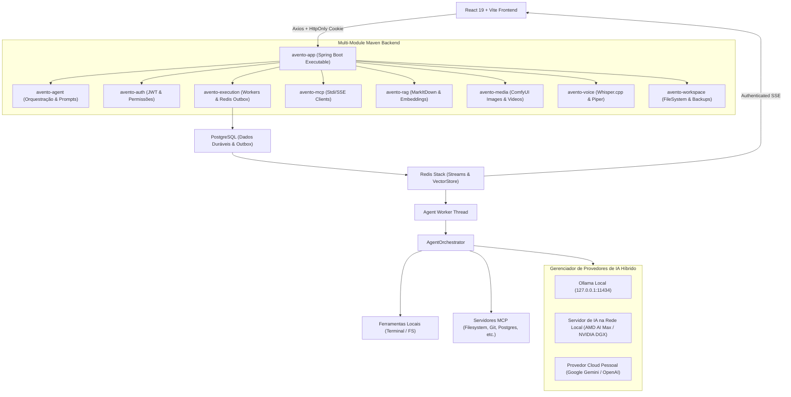

<p align="center">
  <a href="README.md"></a>
  <a href="README.pt-BR.md"></a>
</p>

<p align="center">
  
</p>

<h1 align="center">Avento AI</h1>

<p align="center">
  A local-first assistant that understands projects, uses tools, and works with you on your own machine.
</p>

<p align="center">
  <strong>Java 21</strong> · <strong>React 19</strong> · <strong>Ollama</strong> · <strong>MCP</strong> · <strong>ComfyUI</strong> · <strong>Whisper.cpp</strong>
</p>

<p align="center">
  <a href="https://github.com/SamuckqaDev/avento-ia/actions/workflows/ci.yml"></a>
  
  
  
</p>

> [!IMPORTANT]
> Avento is under active development and is meant for local use on macOS. The backend, frontend, models, and tools listen only on loopback by default. Review the security section before allowing remote access.

## Overview

Avento brings together, in a single interface, a chat with local models and an agent able to inspect projects, ask for permission, run tools, and verify the result. The goal is not just to answer questions: it is to follow real tasks through without shipping your project's code to a mandatory API.

Avento was created and developed by **Samuel Tomimatu, software engineer and sole creator of the project**.

| Projects and code | Agent and automation | Multimodal and knowledge |
|---|---|---|
| Authorized workspaces | Orchestrator with an execution loop | Document reading with MarkItDown |
| File read, search, and edit | Visual and voice Permission Engine | Incremental RAG with Redis Vector Store |
| Diff, backup, and restore | Local tools and MCP servers | Vision with compatible Ollama models |
| Controlled terminal | macOS and browser automation | Image and video generation via ComfyUI |
| Project database discovery | Built-in and custom skills | STT with Whisper.cpp and neural TTS with Kokoro |
| Interactive HTML prototypes | Review on desktop, tablet, and phone | Implementation only after approval |

### What is technically interesting

Five things worth opening the code for. The full feature list lives in
[docs/FEATURES.md](docs/FEATURES.md); the architecture, in
[docs/ARCHITECTURE.md](docs/ARCHITECTURE.md).

- **An agent loop with a human in it.** Rounds of tool calls where every action can require
  approval before it runs — by clicking or by voice — and a plan approved once does not
  re-ask for each step, except for the destructive ones.
- **Durable execution, not a request that hopes to survive.** PostgreSQL as the source of
  truth, an Outbox, Redis Streams, a worker and authenticated SSE. Duplicate entries never
  re-run a tool or re-present a resolved decision, and an activity watchdog ends silent runs
  instead of leaving the chat stuck.
- **The agent owns the tools, the provider is only transport.** Ollama, Gemini, Anthropic and
  any OpenAI-compatible endpoint see the same files, terminal, MCP servers and RAG. Switching
  provider does not change what the agent can do.
- **A context budget that holds.** Tool history is compacted with a ceiling, the round's
  toolset is selected by intent, and the system prompt keeps a stable prefix so Ollama's
  prompt cache actually hits — a timestamp in that prefix once cost ~50s per response.
- **Progressive tool discovery.** The model searches for capabilities and activates what it
  needs, instead of paying for dozens of tool schemas in every request.

## Ready-Made Skills

Type `/skills` in the chat to list the available procedures. Skills with triggers also activate by natural language. A skill can declare `Ferramenta:` in its header: in that case the corresponding tool is exposed to the model with priority during selection (immune to the keyword heuristics), guaranteeing, for example, that `/generate-video` reaches `generate_video` and not `generate_image`. A skill always goes through the model, which reasons and decides the call.

| Skill | Purpose |
|---|---|
| `/analyze-project` | Inspect structure, manifests, code, and risks without changing files |
| `/fix-project` | Investigate, edit, and validate a requested fix |
| `/diagnose-project` | Reproduce failures and analyze logs, build, or tests |
| `/run-project` | Discover scripts, start processes, and confirm logs/ports |
| `/create-vite-project` and `/nestjs-project` | Create scaffolds using the official tools |
| `/read-document` | Read PDF, Office, EPUB, ZIP, OCR, audio, and text with MarkItDown |
| `/translate-content` | Faithfully translate provided text, preserving tone and explicit language without editorial censorship |
| `/inspect-database` | Discover the DBHub, inspect the schema, and run controlled queries |
| `/java-project-maintenance` | Apply DTOs, Lombok, layers, SOLID, and Clean Code in Java/Spring projects |
| `/spring-security-maintenance` and `/database-migration` | Maintain JWT/cookie auth, ownership, schema, and Flyway with security and data tests |
| `/async-execution-diagnostics` | Trace a `runId` through PostgreSQL, outbox, Redis Streams, worker, and SSE when the chat keeps thinking |
| `/mcp-integration-maintenance` | Maintain lifecycle, contracts, scopes, permissions, and real verification of MCP servers |
| `/avento-frontend-maintenance` | Fix React, responsiveness, streaming, and per-chat/run isolated state |
| `/prototype-interface` | Design and review a local HTML screen before changing the workspace |
| `/media-pipeline-maintenance` and `/voice-pipeline-maintenance` | Diagnose ComfyUI, Whisper, Piper, jobs, preview, and local playback |
| `/rag-knowledge-maintenance` | Maintain ingestion, chunking, embeddings, Redis Vector Store, and source-backed answers |
| `/dependency-modernization` | Update dependencies in compatible groups with evidence and incremental validation |
| `/avento-finalize-change` and `/release-readiness` | Close changes with docs/commit and run the full gate before publishing |
| `/manage-mcp` and `/web-research` | Connect MCP capabilities and research with real evidence |
| `/git-workflow` and `/docker-workflow` | Review Git and operate services/containers with real confirmation |
| `/manage-memory` | Store, query, and remove knowledge from local memory |
| `/generate-image` and `/generate-video` | Run the local visual pipelines with the frontend options |
| `/mac-workflow` | Coordinate apps, tabs, Finder, shortcuts, and capture on macOS |
| `/tool-registered-but-not-found` | Trace a tool the dispatcher claims not to know, from the round's toolset to duplicate classes |
| `/model-choice-ignored` | Find where the model picked in the header select is discarded before the round |
| `/workspace-write-refused` | Read works, write does not: symlinks in the authorized path |
| `/slow-agent-round` | Split prompt evaluation from generation before tuning anything |
| `/docker-mcp-gateway-down` | The gateway is a Docker Desktop plugin, not a daemon feature |

Built-in skills live in `back/avento/avento-workspace/src/main/resources/agent/skills/`. Skills created through the interface are personal, live in `data/skills/`, and take priority without changing the source code.

The policies versioned in `back/avento/avento-agent/src/main/resources/agent/policies/` are the project's public configuration. A machine may keep a personal policy in `~/.avento/policies/{mode}.md`; when that file exists, the backend uses it instead of the built-in policy without including its content in Git. The instructions consumed by the model are written in English to improve adherence on local models; the interface and the responses stay in the user's language.

For agents working on the repository itself, `AGENTS.md` points to the skills versioned in `.agents/skills/`. They cover the Java standard as well as security, database, MCP, async execution, frontend, media, voice, RAG, dependencies, finalization, and release.

## Brand and Logo

<p align="center">
  
</p>

Avento's identity represents an assistant that turns context into action while keeping the user in control:

- the **geometric A** identifies the brand and suggests forward motion;
- the **two slanted planes** represent movement and construction;
- the **central path** represents the flow between conversation, local model, Permission Engine, and MCP tools;
- the **pink node** represents a concrete, approved, and verifiable action;
- the **deep green**, the **mint**, and the **pink** balance trust, technology, and action.

The official files are [`avento-logo.svg`](front/src/assets/avento-logo.svg) and [`favicon.svg`](front/public/favicon.svg). See the [visual identity guide](docs/BRAND.md) for palette, sizes, and usage rules.

## Architecture


```mermaid
flowchart TD
    UI["React 19 + Vite Frontend"] -->|"Axios + HttpOnly Cookie"| APP["avento-app (Spring Boot Executable)"]

    subgraph BACKEND["Multi-Module Maven Backend"]
        APP --> AGENT["avento-agent (Orquestração & Prompts)"]
        APP --> AUTH["avento-auth (JWT & Permissões)"]
        APP --> EXEC["avento-execution (Workers & Redis Outbox)"]
        APP --> MCP_MOD["avento-mcp (Stdi/SSE Clients)"]
        APP --> RAG_MOD["avento-rag (MarkItDown & Embeddings)"]
        APP --> MEDIA_MOD["avento-media (ComfyUI Images & Videos)"]
        APP --> VOICE_MOD["avento-voice (Whisper.cpp & Piper)"]
        APP --> WORKSPACE["avento-workspace (FileSystem & Backups)"]
    end

    EXEC --> PG["PostgreSQL (Dados Duráveis & Outbox)"]
    PG --> REDIS["Redis Stack (Streams & VectorStore)"]
    REDIS --> WORKER["Agent Worker Thread"]
    WORKER --> ORCH["AgentOrchestrator"]
    REDIS -->|"Authenticated SSE"| UI

    subgraph PROVIDERS["Gerenciador de Provedores de IA Híbrido"]
        OLLAMA["Ollama Local (127.0.0.1:11434)"]
        LAN_SERVER["Servidor de IA na Rede Local (AMD AI Max / NVIDIA DGX)"]
        CLOUD_API["Provedor Cloud Pessoal (Google Gemini / OpenAI)"]
    end

    ORCH --> PROVIDERS
    ORCH --> LOCAL_TOOLS["Ferramentas Locais (Terminal / FS)"]
    ORCH --> MCP_SRV["Servidores MCP (Filesystem, Git, Postgres, etc.)"]
```

The frontend never receives the authentication token. The backend concentrates session, workspace authorization, persistence, model calls, and tool execution. Actions with an effect on the computer pass through the Permission Engine before reaching the local or MCP provider. Memories, settings, media, approvals, rollback manifests, MCP clients, processes, and timeline are scoped by the authenticated user and chat. Pending approvals and file-change manifests are persisted in PostgreSQL, so a backend restart does not transfer ownership or silently lose the action awaiting confirmation.

The JSON REST routes use a single contract:

```json
{
  "status": 200,
  "code": "SUCCESS",
  "data": { "id": 7, "title": "My chat" }
}
```

`status` echoes the HTTP status, `code` is stable for automation, and `data` holds the result. Empty collections return `data: []`. On failures, `data` holds `message`, `path`, `timestamp`, `traceId`, and any field errors. SSE, audio, and downloads keep the native formats of their respective protocols. The shared Axios client unwraps JSON responses to preserve the types used by the interface.

More detail: [current architecture](docs/ARCHITECTURE.md) and [agent and MCP orchestration](docs/ORCHESTRATION.md). The flow of jobs, context, and events is explained step by step in [async execution with Redis](docs/REDIS_EXECUTION.md).

## Structure

```text
avento-ia/
├── front/                     # React, TypeScript, Vite, and styled-components
├── back/
│   ├── avento/                # Parent POM Multi-Módulo Maven (core, auth, workspace, mcp, execution, agent, media, voice, rag, app)
│   └── whisper.cpp/           # Local runtime; not versioned
├── piper_tts/                 # Local runtime and voices; not versioned
├── ~/.avento/tools/           # MarkItDown and MCP runtimes, outside the repository
├── scripts/                   # Setup, startup, and smoke tests
├── docs/                      # Technical and operational guides
├── docker-compose.yml         # PostgreSQL and Redis Stack
├── .env.example               # Safe configuration example
└── .env                       # Local configuration; not versioned
```

## Requirements

### Required

- Java 21
- Maven
- Node.js, npm, and npx
- Docker Desktop, Docker Engine, or Colima
- Ollama

### Recommended

- FFmpeg for the audio pipeline
- Python 3 for ComfyUI, Piper, and helper tools
- CMake to build or update Whisper.cpp

Check the environment:

```bash
./scripts/check-local-deps.sh
```

## Quick Start

### 1. Configure the environment

```bash
cp .env.example .env
```

Set `AVENTO_AUTH_ROOT_PASSWORD` in `.env`. If it is empty, the development script generates a random password and saves it only in the local file ignored by Git.

### 2. Local models

```bash
ollama pull qwen3:8b
ollama pull llama3.2
ollama pull nomic-embed-text
```

### 3. Start Avento

In another terminal:

```bash
./scripts/dev-up.sh
```

The script prepares and connects the local MCP tools, starts PostgreSQL, Redis, and Ollama, installs or starts ComfyUI, resolves dependencies, brings up the backend and frontend, and runs an authenticated smoke test. If Ollama is already running, the existing instance is reused.

At the end, it prints the URLs used. The default values are:

| Service | URL |
|---|---|
| Frontend | `http://127.0.0.1:5173` |
| Backend | `http://127.0.0.1:8000` |
| ComfyUI | `http://127.0.0.1:8188` |
| Ollama | `http://127.0.0.1:11434` |

Logs live in `tmp/dev/` and are also streamed live to the script's terminal. Each agent round logs start, completion, or failure; ComfyUI generations log enqueue, progress every 10 seconds, and the finished file path. The local root login is printed before and after startup. Use `Ctrl+C` to stop the processes started by the script.

## Manual Run

```bash
# PostgreSQL and Redis Stack, with migration of legacy containers
./scripts/prepare-docker-stack.sh

# Backend, run from the repository root
mvn -f back/avento/pom.xml spring-boot:run -pl avento-app -am \
  -Dspring-boot.run.profiles=local

# Frontend
npm --prefix front install
npm --prefix front run dev
```

The backend must be started from the root to find `.env`, `back/whisper.cpp`, `piper_tts`, and the temporary directories. MarkItDown and the npm cache live under `~/.avento/tools` by default, keeping about a gigabyte of local runtime outside the Git worktree.

## Local Models and Services

### Chat and RAG

For local models, Avento reads the context window declared by the selected model and uses the lower
value between it and `AVENTO_AGENT_NUM_CTX`. The local default is 8,192 tokens to keep the KV cache
from exhausting a 16 GB machine while chat, RAG, and the interface are active. Increase that cap only
when the machine has enough memory; managed providers keep control of their own declared window.

| Use | Recommendation |
|---|---|
| Agent with tools | `qwen3:8b` |
| Lightweight text fallback | `llama3.2` |
| Embeddings | `nomic-embed-text` |
| Image reading | `llama3.2-vision`, `llava`, or equivalent |

The model chosen in the interface travels with the request. `AVENTO_AGENT_DEFAULT_MODEL` is used only when no model is provided. The backend sends explicit inference parameters to Ollama (`temperature=0.15`, `top_p=0.9`, `top_k=30`, and `repeat_penalty=1.08` by default), all overridable via `AVENTO_AGENT_*` variables. Short continuations such as "continue" or "try again" receive the last substantive request in a continuity block to avoid a goal switch when the history is compacted.

### Obsidian knowledge vault

Open **Settings → Knowledge** and choose **Create vault and index**. Avento creates a regular local
Markdown vault at `~/.avento/obsidian-vault` (or at `AVENTO_OBSIDIAN_VAULT_PATH`), with folders for
inbox, knowledge, projects, reviewable notes, and policy references. Open that same folder as a vault
in Obsidian, write notes, and request a reindex after editing. Reindexing is incremental: unchanged
files keep their existing vectors in Redis.

Vault notes are retrieved as cited reference material in the chat. They never become system prompts,
do not grant tool permissions, and do not replace Avento's authenticated long-term memory, which
remains stored per user in PostgreSQL.

### Image and video

**ComfyUI generates Avento's images and videos.** It is separate from the Ollama models: Ollama drives the conversation and can interpret images with a multimodal model, while ComfyUI runs the visual generation workflows and returns the files to the chat. Visual generation requires no workspace or MCP server. Explicit requests and standalone visual descriptions with enough style and composition signals are routed directly to `generate_image`; requests to analyze, explain, or improve a prompt stay in the conversation.

| Feature | Default provider and model | Result |
|---|---|---|
| Image | ComfyUI + RealVisXL V5 SDXL, Realistic Vision V6, or FLUX.2 Klein 4B | PNG shown in the chat and registered in the conversation gallery |
| Text-to-video | ComfyUI + WAN 2.2 TI2V 5B | Animated WebP created from the prompt |
| Image-to-video | ComfyUI + WAN 2.2 TI2V 5B | Animated WebP that keeps the most recent image as the first frame |

Avento detects the installed SD, SDXL checkpoints and FLUX.2 diffusion models, selects the correct workflow for each architecture, and keeps all of them in the image selector. The default is RealVisXL V5 at native SDXL resolution. Each checkpoint family uses its own preset (sampler, steps, CFG, and native resolution per quality level), defined in `comfyui/model-presets.json` and overridable via `~/.avento/image-presets.json` without recompiling. The preset also declares the encoder's prompt style: `tags` for SDXL/SD 1.5 receives the planner's reinforced prompt, while `natural` for FLUX.2 Klein (whose encoder is an LLM) receives the translated request as a sentence — FLUX.2 models treat keyword soup as noise. Before SDXL, the request is translated to English because CLIP does not understand Portuguese. The header menu offers quality, primary subject, aspect ratio, subject count, CFG, second pass, detailers, pose reference, prompt enhancement, seed, and three distinct uses for the last attached image: `Composition` preserves depth or contours with ControlNet, `Identity` uses IP-Adapter, and `Transform` runs img2img. These choices take precedence over arguments suggested by the model.

`Validate result` unloads the generation checkpoint, asks the local vision model to compare the image to the request, and can regenerate with an objective correction. The configurable limit is zero to two extra attempts; each attempt increases the total time. The review does not replace the structural controls and does not make a diffusion model mathematically deterministic: it reduces divergent results and, if the vision model is unavailable, preserves the already generated image instead of blocking delivery.

The setup installs the ComfyUI runtime in `~/ComfyUI`. `scripts/setup-comfyui-sdxl.sh` prepares RealVisXL V5, the SDXL VAE, ControlNet OpenPose/Canny/Depth, IP-Adapter, and Depth Anything, at roughly 19 GB. `scripts/setup-comfyui-image.sh` maintains the legacy SD 1.5 pipeline with Realistic Vision V6, and `scripts/setup-comfyui-flux2.sh` installs FLUX.2 Klein 4B. All downloads are resumable and verified by SHA-256. The SDXL install can be disabled with `AVENTO_COMFYUI_SDXL_AUTO_INSTALL=0`; the default model, the adherence threshold, and the workflow can be overridden via `AVENTO_COMFYUI_DEFAULT_MODEL`, `AVENTO_COMFYUI_ADHERENCE_MIN_SCORE`, and `AVENTO_COMFYUI_SDXL_WORKFLOW`. WAN 2.2 TI2V 5B, its VAE, and the shared encoder are still installed for videos.

Image and video use jobs persisted in PostgreSQL and separate local workers, both limited to one generation at a time to respect the machine's memory. The agent call returns immediately; the chat shows the step, estimated progress, elapsed time, remaining forecast, and cancellation. On completion, the file is registered in the conversation, the side gallery is refreshed, and the media appears minimized in the balloon itself.

The video workflow lives in `back/avento/avento-media/src/main/resources/comfyui/workflows/text-to-video-api.json`. It uses hybrid WAN 2.2: by default it animates the most recent image in the conversation; `mode=text` creates a video from scratch and `mode=image` requires a previous image. The backend validates the diffusion model, text encoder, and VAE before enqueueing the generation and saves the result as an animated WebP in `~/Pictures/Avento Generated Images`.

Jobs interrupted by a backend restart are resumed. When a chat is deleted, Avento cancels active image and video jobs and also removes their records and files linked to the conversation.

### Interface prototyping

Requests for `screen mockup`, `interface mockup`, `ui mockup`, `website mockup`, `wireframe`, or prototype activate `prototype-interface` before image routing. Avento returns self-contained HTML, CSS, and JavaScript in an interactive viewer in the chat, initially collapsed into a clickable thumbnail, with desktop, tablet, phone, and expand modes. This path does not call ComfyUI or create an image: the browser renders the artifact, which is persisted in the conversation's normal content. The document runs in an isolated iframe, without network and without access to Avento's session. After explicit user approval, the agent translates the proposal into the workspace's real components and can validate them with Playwright. See the [local prototyping guide](docs/INTERFACE_PROTOTYPING.md).

### Documents in the chat

The clip button in the composer accepts up to four documents per message, at a maximum of 50 MB per file. PDF, Word, Excel, PowerPoint, EPUB, ZIP, text files, and common code formats are accepted. The authenticated endpoint `POST /api/documents/extract` creates a temporary copy, extracts the content locally, and removes that copy when done. Plain text is read directly; the other formats use the MarkItDown installed by `scripts/setup-local-mcps.sh` under `~/.avento/tools/mcp`.

To protect the local model's context window, each document contributes up to `AVENTO_DOCUMENT_ATTACHMENT_MAX_CONTEXT_CHARS` characters, 5,000 by default. The name and the extracted context are persisted in the message and reused when reopening the conversation; the original file stays only in the location chosen by the user.

### Voice

```text
microphone → WebM → FFmpeg → Whisper.cpp → text
text → local Kokoro neural TTS → WAV → browser
```

The voice control is global for the interface. When muting, Avento interrupts the current speech, drops the queue, and invalidates syntheses still in progress; new chunks cannot turn the audio back on. The choice is saved in the browser. When unmuting, only new phrases from the currently open chat can play.

Expected local files:

```text
back/whisper.cpp/build/bin/whisper-cli
back/whisper.cpp/models/ggml-small.bin
back/whisper.cpp/models/ggml-silero-v6.2.0.bin
piper_tts/.venv/bin/piper
piper_tts/pt_BR-dii-high.onnx
piper_tts/en_US-lessac-medium.onnx
~/.avento/tools/kokoro-tts/  # isolated neural TTS runtime, managed by Avento
```

## MCP and Permissions

The catalog uses the official MCP Java SDK 2.x, pinned versions of the npm servers, and an automatic set configurable via `AVENTO_MCP_AUTO_CONNECT`. Specialized tools can also be connected on demand. The available groups include:

- **core:** filesystem, MarkItDown, memory, sequential reasoning, and time;
- **developer:** Git and project tools;
- **data:** PostgreSQL and DBHub;
- **automation:** Desktop Commander, Apple MCP, and macOS automation;
- **web:** Playwright, Puppeteer, Chrome DevTools, Fetch, and SearXNG;
- **advanced:** Docker MCP Gateway.

Repeated connections are idempotent: an already active MCP is not restarted on every message. Desktop Commander remains available in the catalog but must be connected on demand because its startup can be slow on some machines. The SDK's default timeout is 10 seconds and can be changed via `AVENTO_MCP_SDK_REQUEST_TIMEOUT`.

Tools are disclosed progressively: the model starts with the lightweight `search_capabilities` and
`activate_tools` pair, then receives schemas only for the capabilities relevant to the current
request. When a connected Docker MCP Gateway announces an exact native tool name through
`tools/list`, the model sees one canonical tool and Avento routes it to Docker. The native host
implementation stays available only when the gateway is absent or did not announce that exact
capability; a Docker execution error is returned as-is and never falls back silently to the host.

Destructive or externally effective tools require approval. Temporary permissions are bound to the user, project, tool, resource, and duration; approvals can also be answered by voice.

When the user knows a project name but not its path, the read-only `find_local_project` tool searches
directory names under that user's home folder (never the whole filesystem). It skips caches and
dependency folders such as `Library`, `node_modules`, `.git`, `build`, and `target`, returns at most
20 matches, and does not grant workspace access. The user still chooses a result before opening,
indexing, or editing it.

See the [full MCP catalog](docs/LOCAL_MCP_CATALOG.md).

## Authentication and Data

- The access token stays in the `avento_access` cookie with `HttpOnly`.
- The frontend uses Axios with `withCredentials=true` and does not read the token.
- JSON REST responses follow `BaseResponse<T>`; the `ControllerAdvice` applies the same format to validation, authentication, and domain errors.
- Refresh is controlled by the backend and tied to the persisted session.
- PostgreSQL stores users, sessions, audit, chats, and messages.
- Redis Stack carries jobs and events and holds recent context, RAG vectors, and local caches.
- Generated images live, by default, in `~/Pictures/Avento Generated Images`.

Minimal example:

```env
AVENTO_AUTH_ROOT_EMAIL=admin@avento.local
AVENTO_AUTH_ROOT_PASSWORD=set-a-strong-password
AVENTO_AUTH_JWT_SECRET=change-this-secret-before-exposing-the-server
```

## Useful Commands

| Goal | Command |
|---|---|
| Check dependencies | `./scripts/check-local-deps.sh` |
| Start the environment | `./scripts/dev-up.sh` |
| Prepare only PostgreSQL and Redis | `./scripts/prepare-docker-stack.sh` |
| Test the backend | `mvn -f back/avento/pom.xml test` |
| Validate the frontend | `npm --prefix front run validate` |
| Validate scripts | `bash -n scripts/*.sh` |
| Validate the Compose file | `docker compose config --quiet` |
| List containers | `docker compose ps` |
| Smoke test | `AVENTO_SMOKE_PASSWORD='...' ./scripts/smoke-local.sh` |

## Security

Avento is local-first, but it performs real actions on the computer. Before allowing remote access:

1. use HTTPS;
2. enable `Secure` cookies;
3. change the JWT secret and all passwords;
4. restrict CORS and network interfaces;
5. review MCPs, workspaces, and granted permissions;
6. use a secrets manager.

`.env`, models, native runtimes, local databases, logs, dependencies, and builds stay out of Git.

## Documentation

| Guide | Content |
|---|---|
| [Feature list](docs/FEATURES.md) | The full inventory of what works today |
| [Learnings](docs/aprendizados/README.md) | The bugs that cost the most, explained from the symptom to the root cause |
| [Identity and personality](docs/AVENTO_IDENTITY.md) | Origin, Samuel Tomimatu's authorship, verified services, voice, and behavior |
| [Current architecture](docs/ARCHITECTURE.md) | Diagram of components, flows, data, voice, media, and MCP |
| [Evolution plan (historical)](docs/historico/IMPLEMENTATION_PLAN.md) | Original phases and acceptance criteria; current behavior is documented in the architecture |
| [Local setup](docs/SETUP.md) | Installation, services, voice, security, and diagnostics |
| [Orchestration](docs/ORCHESTRATION.md) | Agent loop, states, and MCP integration |
| [MCP catalog](docs/LOCAL_MCP_CATALOG.md) | Servers, profiles, project database, and configuration |
| [Interface prototyping](docs/INTERFACE_PROTOTYPING.md) | Local HTML preview, isolation, review, and approval before code |
| [Roadmap (historical)](docs/historico/AGENT_ROADMAP.md) | Initial planned agent evolution; current behavior is documented in the architecture |
| [Visual identity](docs/BRAND.md) | Logo, palette, and brand guidelines |
| [Contributing](CONTRIBUTING.md) | Code standards and validations |

## Current Limitations

- The development flow is primarily targeted at macOS.
- Ollama models, ComfyUI checkpoints, and Piper voices are not distributed in the repository.
- The main frontend bundle is 1.17 MB (327 kB gzipped) and still crosses Vite's 500 kB warning
  threshold; code splitting has not been done yet.
- The default configuration should not be exposed directly to the internet.

---

<p align="center">
  <strong>Avento AI</strong><br>
  Local code, real tools, and decisions under your control.
</p>
