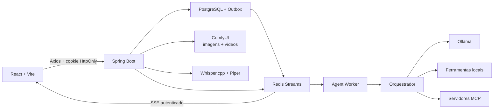

<p align="center">
  <a href="README.md"></a>
  <a href="README.pt-BR.md"></a>
</p>

<p align="center">
  
</p>

<h1 align="center">Avento IA</h1>

<p align="center">
  Um assistente local-first que entende projetos, usa ferramentas e trabalha com você no seu computador.
</p>

<p align="center">
  <strong>Java 21</strong> · <strong>React 19</strong> · <strong>Ollama</strong> · <strong>MCP</strong> · <strong>ComfyUI</strong> · <strong>Whisper.cpp</strong>
</p>

<p align="center">
  <a href="https://github.com/SamuckqaDev/avento-ia/actions/workflows/ci.yml"></a>
  
  
  
</p>

> [!IMPORTANT]
> O Avento está em desenvolvimento ativo e foi preparado para uso local no macOS. Backend, frontend, modelos e ferramentas escutam apenas em loopback por padrão. Revise a seção de segurança antes de permitir acesso remoto.

## Visão Geral

O Avento reúne, em uma única interface, um chat com modelos locais e um agente capaz de inspecionar projetos, pedir permissão, executar ferramentas e verificar o resultado. O objetivo não é apenas responder perguntas: é acompanhar tarefas reais sem enviar o código do projeto para uma API obrigatória.

O Avento foi criado e desenvolvido por **Samuel Tomimatu, engenheiro de software e único criador do projeto**.

| Projetos e código | Agente e automação | Multimodal e conhecimento |
|---|---|---|
| Workspaces autorizados | Orquestrador com ciclo de execução | Leitura de documentos com MarkItDown |
| Leitura, busca e edição de arquivos | Permission Engine visual e por voz | RAG incremental com Redis Vector Store |
| Diff, backup e restauração | Ferramentas locais e servidores MCP | Visão com modelos Ollama compatíveis |
| Terminal controlado | Automação de macOS e navegador | Geração de imagens e vídeos pelo ComfyUI |
| Descoberta de bancos do projeto | Skills internas e personalizadas | STT com Whisper.cpp e TTS neural com Kokoro |
| Protótipos HTML interativos | Revisão em desktop, tablet e celular | Implementação somente após aprovação |

### O que é tecnicamente interessante

Cinco coisas que valem abrir o código. A lista completa de funcionalidades está em
[docs/FEATURES.pt-BR.md](docs/FEATURES.pt-BR.md); a arquitetura, em
[docs/ARCHITECTURE.md](docs/ARCHITECTURE.md).

- **Um laço de agente com gente dentro.** Rodadas de chamada de ferramenta em que cada ação
  pode exigir aprovação antes de rodar — por clique ou por voz — e um plano aprovado uma vez
  não volta a perguntar a cada passo, exceto nas ações destrutivas.
- **Execução durável, não uma requisição torcendo para sobreviver.** PostgreSQL como fonte da
  verdade, Outbox, Redis Streams, worker e SSE autenticado. Entrada duplicada nunca repete
  ferramenta nem reapresenta decisão já resolvida, e um watchdog encerra run silenciosa em vez
  de deixar o chat travado.
- **O agente é dono das ferramentas; o provedor é só transporte.** Ollama, Gemini, Anthropic e
  qualquer endpoint compatível com OpenAI enxergam os mesmos arquivos, terminal, servidores MCP
  e RAG. Trocar de provedor não muda o que o agente consegue fazer.
- **Um orçamento de contexto que se sustenta.** O histórico de ferramentas é compactado com
  teto, o toolset da rodada é escolhido por intenção, e o system prompt mantém prefixo estável
  para o cache de prompt do Ollama realmente acertar — um timestamp nesse prefixo já custou
  ~50s por resposta.
- **Descoberta progressiva de ferramentas.** O modelo procura capacidades e ativa o que
  precisa, em vez de pagar por dezenas de schemas em toda requisição.

## Skills Prontas

Digite `/skills` no chat para listar os procedimentos disponíveis. Skills com gatilhos também
ativam por linguagem natural. Uma skill pode declarar `Ferramenta:` no cabeçalho: nesse caso a
ferramenta correspondente é exposta ao modelo com prioridade na seleção (imune às heurísticas de
palavra-chave), garantindo, por exemplo, que `/generate-video` chegue ao `generate_video` e não ao
`generate_image`. A skill sempre passa pelo modelo, que raciocina e decide a chamada.

| Skill | Finalidade |
|---|---|
| `/analyze-project` | Inspecionar estrutura, manifests, código e riscos sem alterar arquivos |
| `/fix-project` | Investigar, editar e validar uma correção solicitada |
| `/diagnose-project` | Reproduzir falhas e analisar logs, build ou testes |
| `/run-project` | Descobrir scripts, iniciar processos e confirmar logs/portas |
| `/create-vite-project` e `/nestjs-project` | Criar scaffolds usando as ferramentas oficiais |
| `/read-document` | Ler PDF, Office, EPUB, ZIP, OCR, áudio e texto com MarkItDown |
| `/translate-content` | Traduzir fielmente texto fornecido, preservando tom e linguagem explícita sem censura editorial |
| `/inspect-database` | Descobrir o DBHub, inspecionar esquema e executar consultas controladas |
| `/java-project-maintenance` | Aplicar DTOs, Lombok, camadas, SOLID e Clean Code em projetos Java/Spring |
| `/spring-security-maintenance` e `/database-migration` | Manter autenticação JWT/cookie, ownership, schema e Flyway com testes de segurança e dados |
| `/async-execution-diagnostics` | Rastrear um `runId` por PostgreSQL, outbox, Redis Streams, worker e SSE quando o chat fica pensando |
| `/mcp-integration-maintenance` | Manter lifecycle, contratos, escopos, permissões e verificação real de servidores MCP |
| `/avento-frontend-maintenance` | Corrigir React, responsividade, streaming e estado isolado por chat/run |
| `/prototype-interface` | Desenhar e revisar uma tela HTML local antes de alterar o workspace |
| `/media-pipeline-maintenance` e `/voice-pipeline-maintenance` | Diagnosticar ComfyUI, Whisper, Piper, jobs, preview e playback local |
| `/rag-knowledge-maintenance` | Manter ingestão, chunking, embeddings, Redis Vector Store e respostas apoiadas em fontes |
| `/dependency-modernization` | Atualizar dependências em grupos compatíveis com evidência e validação incremental |
| `/avento-finalize-change` e `/release-readiness` | Fechar mudanças com docs/commit e executar o gate completo antes de publicar |
| `/manage-mcp` e `/web-research` | Conectar capacidades MCP e pesquisar com evidências reais |
| `/git-workflow` e `/docker-workflow` | Revisar Git e operar serviços/containers com confirmação real |
| `/manage-memory` | Guardar, consultar e remover conhecimento da memória local |
| `/generate-image` e `/generate-video` | Executar os pipelines visuais locais com as opções do frontend |
| `/mac-workflow` | Coordenar apps, abas, Finder, atalhos e captura no macOS |
| `/tool-registered-but-not-found` | Rastreia ferramenta que o despachante diz nao conhecer, do toolset da rodada a classe duplicada |
| `/model-choice-ignored` | Descobre onde o modelo escolhido no seletor e descartado antes da rodada |
| `/workspace-write-refused` | Ler funciona, escrever nao: link simbolico no caminho autorizado |
| `/slow-agent-round` | Separa avaliacao de prompt de geracao antes de ajustar qualquer coisa |
| `/docker-mcp-gateway-down` | O gateway e plugin do Docker Desktop, nao recurso do daemon |

As skills embutidas ficam em `back/avento/avento-workspace/src/main/resources/agent/skills/`. Skills criadas pela
interface são pessoais, ficam em `data/skills/` e têm prioridade sem alterar o código-fonte.

As políticas versionadas em `back/avento/avento-agent/src/main/resources/agent/policies/` são a configuração
pública do projeto. Uma máquina pode manter uma política pessoal em
`~/.avento/policies/{modo}.md`; quando esse arquivo existe, o backend o usa no lugar da política
embutida sem incluir seu conteúdo no Git. As instruções consumidas pelo modelo são escritas em
inglês para melhorar aderência em modelos locais; a interface e as respostas continuam no idioma do
usuário.

Para agentes que trabalham no próprio repositório, `AGENTS.md` aponta para as skills versionadas em
`.agents/skills/`. Elas cobrem o padrão Java e também segurança, banco, MCP, execução assíncrona,
frontend, mídia, voz, RAG, dependências, finalização e release.

## Marca e Logo

<p align="center">
  
</p>

A identidade do Avento representa um assistente que transforma contexto em ação mantendo o usuário no controle:

- o **A geométrico** identifica a marca e sugere avanço;
- os **dois planos inclinados** representam movimento e construção;
- o **caminho central** representa o fluxo entre conversa, modelo local, Permission Engine e ferramentas MCP;
- o **nó rosa** representa uma ação concreta, aprovada e verificável;
- o **verde profundo**, a **menta** e o **rosa** equilibram confiança, tecnologia e ação.

Os arquivos oficiais são [`avento-logo.svg`](front/src/assets/avento-logo.svg) e [`favicon.svg`](front/public/favicon.svg). Consulte o [guia de identidade visual](docs/BRAND.md) para paleta, tamanhos e regras de uso.

## Arquitetura



O frontend nunca recebe o token de autenticação. O backend concentra sessão, autorização de workspaces, persistência, chamadas aos modelos e execução de ferramentas. Ações com efeito no computador passam pelo Permission Engine antes de chegar ao provider local ou MCP. Memórias, preferências, mídias, aprovações, manifestos de rollback, clientes MCP, processos e timeline são isolados pelo usuário autenticado e pelo chat. Aprovações pendentes e mudanças de arquivo ficam no PostgreSQL, então reiniciar o backend não transfere ownership nem perde silenciosamente a ação aguardando confirmação.

As rotas REST JSON usam um contrato único:

```json
{
  "status": 200,
  "code": "SUCCESS",
  "data": { "id": 7, "title": "Meu chat" }
}
```

`status` repete o status HTTP, `code` é estável para automação e `data` contém o resultado. Coleções sem itens retornam `data: []`. Em falhas, `data` contém `message`, `path`, `timestamp`, `traceId` e eventuais erros de campo. SSE, áudio e downloads permanecem nos formatos nativos dos respectivos protocolos. O client Axios compartilhado desembrulha respostas JSON para preservar os tipos usados pela interface.

Mais detalhes: [arquitetura atual](docs/ARCHITECTURE.md) e
[orquestração do agente e MCP](docs/ORCHESTRATION.md). O fluxo de jobs, contexto e eventos está
explicado passo a passo em [execução assíncrona com Redis](docs/REDIS_EXECUTION.md).

## Estrutura

```text
avento-ia/
├── front/                     # React, TypeScript, Vite e styled-components
├── back/
│   ├── avento/                # Parent POM Multi-Módulo Maven (core, auth, workspace, mcp, execution, agent, media, voice, rag, app)
│   └── whisper.cpp/           # Runtime local; não é versionado
├── piper_tts/                 # Runtime e vozes locais; não é versionado
├── ~/.avento/tools/           # MarkItDown e runtimes MCP, fora do repositorio
├── scripts/                   # Setup, inicialização e smoke tests
├── docs/                      # Guias técnicos e operacionais
├── docker-compose.yml         # PostgreSQL e Redis Stack
├── .env.example               # Exemplo seguro de configuração
└── .env                       # Configuração local; não é versionada
```

## Requisitos

### Obrigatórios

- Java 21
- Maven
- Node.js, npm e npx
- Docker Desktop, Docker Engine ou Colima
- Ollama

### Recomendados

- FFmpeg para o pipeline de áudio
- Python 3 para ComfyUI, Piper e ferramentas auxiliares
- CMake para compilar ou atualizar o Whisper.cpp

Confira o ambiente:

```bash
./scripts/check-local-deps.sh
```

## Início Rápido

### 1. Configure o ambiente

```bash
cp .env.example .env
```

Defina `AVENTO_AUTH_ROOT_PASSWORD` no `.env`. Se ela estiver vazia, o script de desenvolvimento gera uma senha aleatória e salva apenas no arquivo local ignorado pelo Git.

### 2. Modelos locais

```bash
ollama pull qwen3:8b
ollama pull llama3.2
ollama pull nomic-embed-text
```

### 3. Suba o Avento

Em outro terminal:

```bash
./scripts/dev-up.sh
```

O script prepara e conecta as ferramentas MCP locais, inicia PostgreSQL, Redis e Ollama, instala ou inicia o ComfyUI, resolve dependências, sobe backend e frontend e executa um smoke test autenticado. Se o Ollama já estiver rodando, a instância existente é reutilizada.

Ao final, ele imprime as URLs utilizadas. Os valores padrão são:

| Serviço | URL |
|---|---|
| Frontend | `http://127.0.0.1:5173` |
| Backend | `http://127.0.0.1:8000` |
| ComfyUI | `http://127.0.0.1:8188` |
| Ollama | `http://127.0.0.1:11434` |

Os logs ficam em `tmp/dev/` e tambem sao transmitidos ao vivo no terminal do script. Cada rodada do agente registra inicio, conclusao ou falha; geracoes do ComfyUI registram enfileiramento, progresso a cada 10 segundos e caminho do arquivo concluido. O login root local aparece antes e depois da inicializacao. Use `Ctrl+C` para encerrar os processos iniciados pelo script.

## Execução Manual

```bash
# PostgreSQL e Redis Stack, com migracao de containers legados
./scripts/prepare-docker-stack.sh

# Backend, executado a partir da raiz
mvn -f back/avento/pom.xml spring-boot:run -pl avento-app -am \
  -Dspring-boot.run.profiles=local

# Frontend
npm --prefix front install
npm --prefix front run dev
```

O backend deve ser iniciado a partir da raiz para encontrar `.env`, `back/whisper.cpp`, `piper_tts` e os diretórios temporários. MarkItDown e o cache npm ficam em `~/.avento/tools` por padrão, mantendo cerca de um gigabyte de runtime local fora da árvore Git.

## Modelos e Serviços Locais

### Chat e RAG

| Uso | Recomendação |
|---|---|
| Agente com ferramentas | `qwen3:8b` |
| Fallback textual leve | `llama3.2` |
| Embeddings | `nomic-embed-text` |
| Leitura de imagem | `llama3.2-vision`, `llava` ou equivalente |

O modelo escolhido na interface acompanha a requisição. `AVENTO_AGENT_DEFAULT_MODEL` é usado apenas quando nenhum modelo foi informado. O backend envia ao Ollama parâmetros explícitos de inferência (`temperature=0.15`, `top_p=0.9`, `top_k=30` e `repeat_penalty=1.08` por padrão), todos substituíveis por variáveis `AVENTO_AGENT_*`. Continuações curtas como "continue" ou "tenta de novo" recebem o último pedido substantivo em um bloco de continuidade para evitar troca de objetivo quando o histórico é compactado.

### Imagem e vídeo

O **ComfyUI gera as imagens e os vídeos do Avento**. Ele é separado dos modelos Ollama: o Ollama conduz a conversa e pode interpretar imagens com um modelo multimodal, enquanto o ComfyUI executa os workflows de geração visual e devolve os arquivos para o chat. Geração visual não exige workspace nem servidor MCP. Pedidos explícitos e descrições visuais autônomas com sinais suficientes de estilo e composição são encaminhados diretamente para `generate_image`; pedidos para analisar, explicar ou melhorar um prompt permanecem na conversa.

| Recurso | Provider e modelo padrão | Resultado |
|---|---|---|
| Imagem | ComfyUI + RealVisXL V5 SDXL, Realistic Vision V6 ou FLUX.2 Klein 4B | PNG exibido no chat e registrado na galeria da conversa |
| Vídeo por texto | ComfyUI + WAN 2.2 TI2V 5B | WebP animado criado a partir do prompt |
| Vídeo por imagem | ComfyUI + WAN 2.2 TI2V 5B | WebP animado que preserva a imagem mais recente como quadro inicial |

O Avento detecta os checkpoints SD, SDXL e os diffusion models FLUX.2 instalados, seleciona o workflow correto para cada arquitetura e mantém todos no seletor de imagem. O padrão é o RealVisXL V5 em resolução SDXL nativa. Cada família de checkpoint usa um preset próprio (sampler, passos, CFG e resolução nativa por nível de qualidade), definido em `comfyui/model-presets.json` e sobreponível por `~/.avento/image-presets.json` sem recompilar. O preset também declara o estilo de prompt do encoder: `tags` para SDXL/SD 1.5 recebe o prompt reforçado do planner, enquanto `natural` para o FLUX.2 Klein (cujo encoder é um LLM) recebe o pedido traduzido como frase — os modelos FLUX.2 tratam sopa de palavra-chave como ruído. Antes do SDXL, o pedido é traduzido para inglês porque o CLIP não entende português. O menu do header oferece qualidade, assunto principal, proporção, quantidade de sujeitos, CFG, segundo passe, detailers, referência de pose, melhoria de prompt, seed e três usos distintos para a última imagem anexada: `Composição` preserva profundidade ou contornos com ControlNet, `Identidade` usa IP-Adapter e `Transformação` executa img2img. Essas escolhas prevalecem sobre argumentos sugeridos pelo modelo.

`Validar resultado` descarrega o checkpoint de geração, pede ao modelo visual local que compare a imagem ao pedido e pode refazer a geração com uma correção objetiva. O limite configurável é de zero a duas tentativas extras; cada tentativa aumenta o tempo total. A revisão não substitui os controles estruturais e não torna um modelo de difusão matematicamente determinístico: ela reduz resultados divergentes e, se o modelo visual estiver indisponível, preserva a imagem já gerada em vez de bloquear a entrega.

O setup instala o runtime do ComfyUI em `~/ComfyUI`. `scripts/setup-comfyui-sdxl.sh` prepara o RealVisXL V5, VAE SDXL, ControlNet OpenPose/Canny/Depth, IP-Adapter e Depth Anything, em aproximadamente 19 GB. `scripts/setup-comfyui-image.sh` mantém o pipeline SD 1.5 legado com Realistic Vision V6, e `scripts/setup-comfyui-flux2.sh` instala o FLUX.2 Klein 4B. Todos os downloads são retomáveis e verificados por SHA-256. A instalação SDXL pode ser desabilitada com `AVENTO_COMFYUI_SDXL_AUTO_INSTALL=0`; o modelo padrão, o limite de aderência e o workflow podem ser substituídos por `AVENTO_COMFYUI_DEFAULT_MODEL`, `AVENTO_COMFYUI_ADHERENCE_MIN_SCORE` e `AVENTO_COMFYUI_SDXL_WORKFLOW`. O WAN 2.2 TI2V 5B, seu VAE e o encoder compartilhado continuam sendo instalados para vídeos.

Imagem e vídeo usam jobs persistidos no PostgreSQL e workers locais separados, ambos limitados a uma geração por vez para respeitar a memória da máquina. A chamada do agente retorna imediatamente; o chat mostra etapa, progresso estimado, tempo decorrido, previsão restante e cancelamento. Ao concluir, o arquivo é registrado na conversa, a galeria lateral é atualizada e a mídia aparece minimizada no próprio balão.

O workflow de vídeo fica em `back/avento/avento-media/src/main/resources/comfyui/workflows/text-to-video-api.json`. Ele usa o WAN 2.2 híbrido: por padrão, anima a imagem mais recente da conversa; `mode=text` cria um vídeo do zero e `mode=image` exige uma imagem anterior. O backend valida diffusion model, text encoder e VAE antes de enfileirar a geração e salva o resultado como WebP animado em `~/Pictures/Avento Generated Images`.

Jobs interrompidos por uma reinicialização do backend são retomados. Ao apagar um chat, o Avento cancela jobs ativos de imagem e vídeo e remove também seus registros e arquivos vinculados à conversa.

### Prototipação de interfaces

Pedidos de `mockup de tela`, `mockup de interface`, `ui mockup`, `website mockup`, `wireframe` ou
protótipo ativam `prototype-interface` antes do roteamento de imagens. O Avento devolve HTML, CSS e
JavaScript autocontidos em um visualizador interativo no chat, inicialmente recolhido em uma
miniatura clicável, com modos desktop, tablet, celular e expansão. Esse caminho não chama o ComfyUI
nem cria uma imagem: o navegador renderiza o artefato, que fica persistido no conteúdo normal da
conversa. O documento roda em um iframe isolado, sem rede e sem acesso à sessão do Avento. Depois da
aprovação explícita do usuário, o agente traduz a proposta para os componentes reais do workspace e
pode validá-los com Playwright. Veja o
[guia de prototipação local](docs/INTERFACE_PROTOTYPING.md).

### Documentos no chat

O botão de clipe no composer aceita até quatro documentos por mensagem, com no máximo 50 MB por arquivo. São aceitos PDF, Word, Excel, PowerPoint, EPUB, ZIP, arquivos de texto e formatos comuns de código. O endpoint autenticado `POST /api/documents/extract` cria uma cópia temporária, extrai o conteúdo localmente e remove essa cópia ao terminar. Texto simples é lido diretamente; os demais formatos usam o MarkItDown instalado por `scripts/setup-local-mcps.sh` em `~/.avento/tools/mcp`.

Para proteger a janela de contexto do modelo local, cada documento contribui com até `AVENTO_DOCUMENT_ATTACHMENT_MAX_CONTEXT_CHARS` caracteres, 5.000 por padrão. O nome e o contexto extraído ficam persistidos na mensagem e voltam a ser usados ao reabrir a conversa; o arquivo original permanece somente no local escolhido pelo usuário.

### Voz

```text
microfone → WebM → FFmpeg → Whisper.cpp → texto
texto → TTS neural local Kokoro → WAV → navegador
```

O controle de voz e global para a interface. Ao mutar, o Avento interrompe a fala atual, descarta a
fila e invalida sinteses ainda em andamento; novos chunks nao conseguem religar o audio. A escolha
fica salva no navegador. Ao desmutar, somente novas frases do chat atualmente aberto podem tocar.

Arquivos locais esperados:

```text
back/whisper.cpp/build/bin/whisper-cli
back/whisper.cpp/models/ggml-small.bin
back/whisper.cpp/models/ggml-silero-v6.2.0.bin
piper_tts/.venv/bin/piper
piper_tts/pt_BR-dii-high.onnx
piper_tts/en_US-lessac-medium.onnx
~/.avento/tools/kokoro-tts/  # runtime neural isolado, gerenciado pelo Avento
```

## MCP e Permissões

O catálogo usa o SDK Java oficial MCP 2.x, versões fixas dos servidores npm e um conjunto automático configurável por `AVENTO_MCP_AUTO_CONNECT`. Ferramentas especializadas também podem ser conectadas sob demanda. Os grupos disponíveis incluem:

- **core:** filesystem, MarkItDown, memória, raciocínio sequencial e tempo;
- **developer:** Git e ferramentas de projeto;
- **data:** PostgreSQL e DBHub;
- **automation:** Desktop Commander, Apple MCP e automação do macOS;
- **web:** Playwright, Puppeteer, Chrome DevTools, Fetch e SearXNG;
- **advanced:** Docker MCP Gateway.

Conexoes repetidas sao idempotentes: um MCP ja ativo nao e reiniciado a cada mensagem. O Desktop Commander permanece disponivel no catalogo, mas deve ser conectado sob demanda porque a inicializacao dele pode ser lenta em algumas maquinas. O timeout padrao do SDK e de 10 segundos e pode ser alterado por `AVENTO_MCP_SDK_REQUEST_TIMEOUT`.

Ferramentas destrutivas ou com efeito externo exigem aprovação. Permissões temporárias são vinculadas ao usuário, projeto, ferramenta, recurso e duração; aprovações também podem ser respondidas por voz.

Veja o [catálogo completo de MCPs](docs/LOCAL_MCP_CATALOG.md).

## Autenticação e Dados

- O access token permanece no cookie `avento_access` com `HttpOnly`.
- O frontend usa Axios com `withCredentials=true` e não lê o token.
- Respostas REST JSON seguem `BaseResponse<T>`; o `ControllerAdvice` aplica o mesmo formato aos erros de validação, autenticação e domínio.
- O refresh é controlado pelo backend e associado à sessão persistida.
- PostgreSQL armazena usuários, sessões, auditoria, chats e mensagens.
- Redis Stack transporta jobs e eventos e mantém contexto recente, vetores do RAG e caches locais.
- Imagens geradas ficam, por padrão, em `~/Pictures/Avento Generated Images`.

Exemplo mínimo:

```env
AVENTO_AUTH_ROOT_EMAIL=admin@avento.local
AVENTO_AUTH_ROOT_PASSWORD=defina-uma-senha-forte
AVENTO_AUTH_JWT_SECRET=troque-este-segredo-antes-de-expor-o-servidor
```

## Comandos Úteis

| Objetivo | Comando |
|---|---|
| Verificar dependências | `./scripts/check-local-deps.sh` |
| Subir o ambiente | `./scripts/dev-up.sh` |
| Preparar somente PostgreSQL e Redis | `./scripts/prepare-docker-stack.sh` |
| Testar o backend | `mvn -f back/avento/pom.xml test` |
| Validar o frontend | `npm --prefix front run validate` |
| Validar scripts | `bash -n scripts/*.sh` |
| Validar o Compose | `docker compose config --quiet` |
| Ver containers | `docker compose ps` |
| Smoke test | `AVENTO_SMOKE_PASSWORD='...' ./scripts/smoke-local.sh` |

## Segurança

O Avento é local-first, mas executa ações reais no computador. Antes de permitir acesso remoto:

1. use HTTPS;
2. habilite cookies `Secure`;
3. troque o segredo JWT e todas as senhas;
4. restrinja CORS e interfaces de rede;
5. revise MCPs, workspaces e permissões concedidas;
6. use um gerenciador de segredos.

`.env`, modelos, runtimes nativos, bancos locais, logs, dependências e builds ficam fora do Git.

## Documentação

| Guia | Conteúdo |
|---|---|
| [Lista de funcionalidades](docs/FEATURES.pt-BR.md) | O inventário completo do que funciona hoje |
| [Aprendizados](docs/aprendizados/README.md) | Os bugs que custaram mais caro, do sintoma à causa raiz |
| [Identidade e personalidade](docs/AVENTO_IDENTITY.md) | Origem, autoria de Samuel Tomimatu, serviços verificados, voz e comportamento |
| [Arquitetura atual](docs/ARCHITECTURE.md) | Diagrama dos componentes, fluxos, dados, voz, mídia e MCP |
| [Plano de evolução (histórico)](docs/historico/IMPLEMENTATION_PLAN.md) | Fases e critérios originais; o comportamento atual está na arquitetura |
| [Setup local](docs/SETUP.md) | Instalação, serviços, voz, segurança e diagnóstico |
| [Orquestração](docs/ORCHESTRATION.md) | Ciclo do agente, estados e integração MCP |
| [Catálogo MCP](docs/LOCAL_MCP_CATALOG.md) | Servidores, perfis, banco do projeto e configuração |
| [Prototipação de interfaces](docs/INTERFACE_PROTOTYPING.md) | Prévia HTML local, isolamento, revisão e aprovação antes do código |
| [Roadmap (histórico)](docs/historico/AGENT_ROADMAP.md) | Evolução inicial planejada do agente; o comportamento atual está na arquitetura |
| [Identidade visual](docs/BRAND.md) | Logo, paleta e diretrizes da marca |
| [Contribuição](CONTRIBUTING.md) | Padrões e validações do código |

## Limitações Atuais

- O fluxo de desenvolvimento é voltado principalmente ao macOS.
- Modelos Ollama, checkpoints do ComfyUI e vozes Piper não são distribuídos no repositório.
- O bundle principal do frontend tem 1,17 MB (327 kB gzipado) e ainda cruza o limite de aviso de
  500 kB do Vite; o code splitting não foi feito.
- A configuração padrão não deve ser exposta diretamente à internet.

---

<p align="center">
  <strong>Avento IA</strong><br>
  Código local, ferramentas reais e decisões sob seu controle.
</p>
