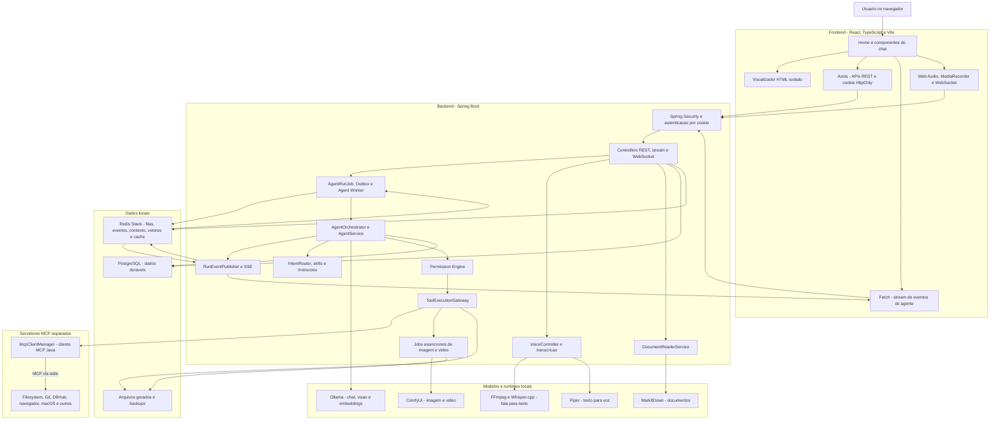
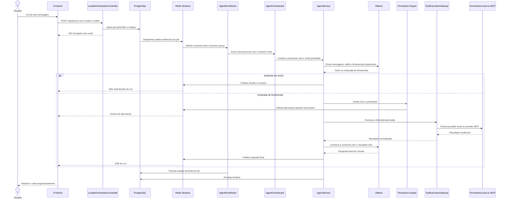
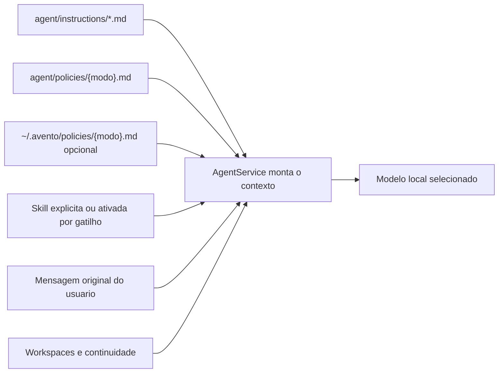
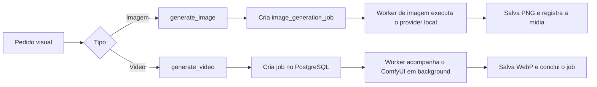
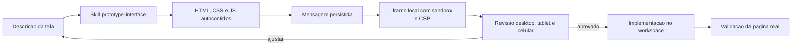
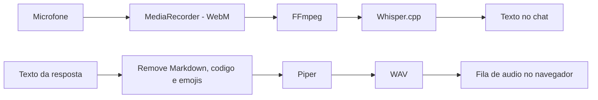
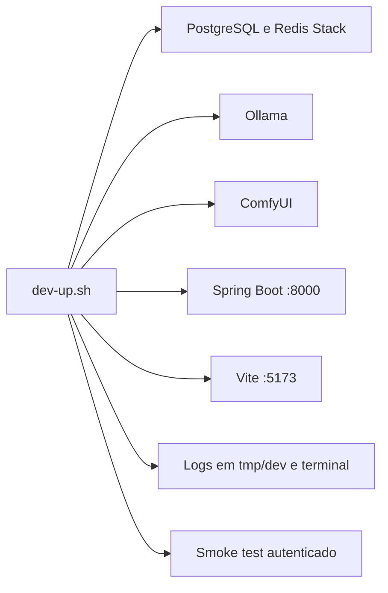

# Arquitetura atual do Avento

Este documento descreve o que existe no repositorio hoje. Ele nao representa a arquitetura futura
nem uma lista de funcionalidades desejadas. A intencao e permitir que uma pessoa nova entenda onde
cada responsabilidade esta, como os processos se comunicam e em quais pontos investigar um erro.

## Visao geral

O Avento e uma aplicacao local-first formada por um frontend React e um backend Spring Boot. O
backend e o centro da arquitetura: autentica o usuario, persiste as conversas, conversa com os
modelos locais, executa ferramentas, controla permissoes e integra os servicos de voz e midia.



## Por que o backend fica no centro

O navegador nao recebe o JWT em JavaScript. O token fica em um cookie `HttpOnly`, e o frontend usa
`Axios` com credenciais para as chamadas REST. O backend valida a sessao antes de acessar chats,
workspaces, midias, ferramentas ou dados persistidos.

Essa fronteira tambem evita que o frontend chame diretamente Ollama, ComfyUI ou um servidor MCP.
Assim, autenticacao, permissoes, auditoria e isolamento por usuario continuam no mesmo lugar.

### Contrato HTTP JSON

Controllers REST retornam `ResponseEntity<BaseResponse<T>>`. O envelope possui `status`, `code` e
`data`: o primeiro acompanha o status HTTP real, o segundo identifica o resultado de forma estavel e
o terceiro carrega o DTO produzido. Uma busca sem resultados continua sendo sucesso e retorna uma
colecao vazia em `data`, nunca `null`.

```json
{
  "status": 200,
  "code": "SUCCESS",
  "data": []
}
```

Erros de validacao, dominio, seguranca e falhas inesperadas passam pelo `ApiExceptionHandler`. Nesse
caso, o erro e o dado retornado e por isso fica dentro de `data`:

```json
{
  "status": 400,
  "code": "VALIDATION_ERROR",
  "data": {
    "message": "Request validation failed.",
    "path": "/api/projects/analyze",
    "timestamp": "2026-07-17T12:00:00Z",
    "traceId": "...",
    "errors": [{ "field": "path", "message": "must not be blank" }]
  }
}
```

`RequestTraceFilter` devolve o mesmo identificador no header `X-Trace-Id`. O Spring Security usa a
mesma fabrica de erros, inclusive para `401` e `403`. Entidades JPA de chat, mensagem e notificacao
nao atravessam a borda HTTP; controllers convertem entradas e saidas por DTOs.

O interceptor em `front/src/services/apiClient.ts` desembrulha apenas envelopes JSON. SSE, WebSocket,
audio sintetizado e download de midia ficam fora do envelope porque seus conversores e protocolos
exigem o corpo bruto.

## Caminho de uma mensagem



Cada execucao carrega `userId`, `chatId` e `runId`. Essa combinacao impede que o thinking, uma
aprovacao ou o resultado de uma ferramenta seja transferido para outra conversa quando o usuario
troca de chat.

### Composicao das instrucoes do agente

O frontend envia a mensagem original e as opcoes da interface, mas nao decide nem filtra o conteudo
da resposta. Antes de chamar o modelo, o backend monta o contexto de sistema com fontes versionadas
e separadas por responsabilidade:



`maximum.md`, `professional.md` e `protected.md` definem a politica publica sem misturar esse texto
no codigo Java. Antes de carregar o recurso embutido, `AgentService` procura um override pessoal com
o mesmo nome em `~/.avento/policies/` (ou em `AVENTO_AGENT_POLICY_OVERRIDE_DIR`). O arquivo local
substitui a politica publica, permanece fora do Git e permite configuracao por maquina. As skills
acrescentam procedimentos especificos e nao substituem a politica. Quando a ativacao e automatica,
`AgentService` preserva integralmente a mensagem original e anexa a skill ao mesmo turno.

O cabecalho de uma skill (logo apos o titulo) aceita, em qualquer ordem, `Gatilhos:` (frases que
ativam a skill sem barra) e `Ferramenta:` (a ferramenta que a skill comanda). A skill sempre passa
pelo modelo — ele raciocina sobre o pedido e decide a chamada. O determinismo NAO vem de pular o
modelo, e sim de garantir que a ferramenta declarada esteja exposta com prioridade na selecao
(`AgentRunState.requiredToolName`), imune as heuristicas de keyword que antes desviavam pedidos de
video para `generate_image`. `generate-video` declara `generate_video` e ganhou gatilhos;
`generate-image` declara `generate_image` mas fica sem gatilhos de proposito, porque "gera uma
imagem" ja e capturado pelo detector direto de imagem.

A skill `translate-content` separa transformacao de criacao: pedidos diretos de traducao mantem o
texto fornecido, o registro, os palavroes e a linguagem adulta ou explicita. Isso evita que uma
traducao fiel seja tratada como endosso ou como um novo pedido de geracao de conteudo.

As politicas e os procedimentos internos diretamente ligados a imagem e traducao usam ingles para
melhor aderencia de instruction-following em modelos locais. Essa escolha e interna: a identidade do
agente ainda determina que a resposta acompanhe o idioma do usuario.

## Agente, ferramentas e MCP

O modelo nao executa uma ferramenta diretamente. O fluxo atual passa por estas camadas:

1. `IntentRouter` reduz o conjunto de ferramentas para o tipo de pedido atual.
2. `SkillRegistry` adiciona um procedimento especializado quando uma skill e ativada.
3. `AgentService` conduz os turnos com o modelo e interpreta as chamadas de ferramenta.
4. `AgentPermissionService` decide se a chamada pode seguir ou precisa de aprovacao.
5. `ToolExecutionGateway` cria uma fronteira unica para ferramentas internas e externas.
6. `McpClientManager` inicia servidores MCP, descobre schemas e faz chamadas pelo SDK Java oficial.

MCP significa Model Context Protocol. No Avento, ele e o protocolo usado para conectar ferramentas;
nao e o modelo, a memoria nem o orquestrador. Os servidores MCP normalmente rodam como processos
separados e conversam com o backend por entrada e saida padrao (`stdio`).

## Imagem e video

Os dois recursos usam jobs persistidos e não ocupam o worker do agente enquanto o modelo visual processa:



Imagem e video devolvem o identificador do job imediatamente. O frontend consulta o endpoint do
tipo de midia a cada dois segundos e mostra etapa, progresso estimado, tempo decorrido, previsao e
cancelamento. Ao concluir, o card dispara a atualizacao da galeria somente depois que o arquivo foi
registrado no PostgreSQL.

Arquivos concluidos sao registrados com o proprietario e o chat em PostgreSQL e armazenados, por
padrao, em `~/Pictures/Avento Generated Images`.

### Traducao do prompt de imagem

O encoder CLIP dos checkpoints SDXL entende apenas ingles e trunca o prompt em 77 tokens, entao um
pedido em portugues chegava ao modelo visual como ruido. Antes do `ImagePromptPlanner`, o
`ImagePromptTranslator` envia o pedido ao modelo de conversa (Ollama, `think:false`, temperatura
0.1) com uma instrucao de traducao literal: preservar cada detalhe pedido e nunca inventar
elementos. Qualquer falha — timeout, HTTP, resposta vazia ou verborragica — mantem o prompt
original. O planner tambem passou a montar o prompt positivo com o conteudo do usuario primeiro:
se o CLIP truncar algo, corta as instrucoes de reforco do planner, nunca o pedido em si.

Configuracao: `avento.image.translation-enabled` (padrao `true`),
`avento.image.translation-model` (padrao: o modelo do agente) e
`avento.image.translation-timeout-seconds` (padrao `45`).

### Presets por modelo de imagem

Cada familia de checkpoint tem seu ponto ideal de sampler, passos, CFG e resolucao nativa. O
`ImageModelPresetCatalog` resolve o preset do checkpoint selecionado a partir de
`comfyui/model-presets.json` (bundled): `sdxl-photoreal` (RealVisXL, JuggernautXL e demais SDXL),
`flux2-klein` (4 passos, CFG 1.0) e `stable-diffusion-1.5` como catch-all (`"match": ["*"]`).
Dentro do preset, o seletor de qualidade do usuario (draft/balanced/quality) escolhe a faixa, e
ajustes manuais sempre vencem: um CFG explicito sobrepoe o do preset e o aspect ratio continua
moldando a resolucao.

O usuario pode sobrepor ou adicionar presets sem recompilar em `~/.avento/image-presets.json`
(caminho configuravel por `avento.image.presets-file`). O arquivo local e relido a cada geracao —
edicoes valem sem reiniciar o backend — e entradas locais tem prioridade sobre as bundled; um JSON
invalido e ignorado com aviso no log, caindo de volta nos presets bundled.

Cada preset tambem declara o `promptStyle` do encoder do modelo. `tags` (SDXL/SD 1.5) recebe o
prompt do planner com pesos e reforcos; `natural` (FLUX.2 Klein, encoder LLM qwen) recebe o pedido
traduzido do usuario como frase — o encoder LLM segue linguagem natural e trata sopa de keywords
como ruido, o que fazia o FLUX.2 ignorar o pedido. O destilado (`flux-2-klein-4b`) roda em 4
passos com CFG 1.0 (recomendacao oficial; mais passos piora); a variante base
(`flux-2-klein-base-*`) tem preset proprio com 16-24 passos e CFG 3.5-4.5. A ordem das entradas
importa: `flux2-klein-base` vem antes de `flux2-klein` porque o match e por substring.

## Saida visual: tabelas, relatorios e PDF

O chat renderiza tabelas Markdown (GFM via `remark-gfm`), `~~riscado~~` e listas de tarefa. Para
relatorios, dashboards e graficos, o modelo responde com um bloco `ui-preview` autocontido (HTML/CSS
inline, sem rede), renderizado no mesmo iframe isolado dos prototipos; a skill `visual-report`
orienta esse formato e o SVG inline dos graficos.

A ferramenta `generate_pdf` (`PdfGenerationService`) converte Markdown com tabelas
(`commonmark-java` + extensao de tabelas) ou HTML em PDF via `openhtmltopdf`, de forma sincrona.
O arquivo `avento-doc-*.pdf` e salvo na pasta de midia, registrado com `mediaType=document`, servido
pelo mesmo `GET /api/media/{filename}` (que passou a reconhecer `.pdf`) e apagado junto com o chat.
O balao mostra um card de download a partir do marcador `[[avento-doc:...]]`.

A skill `/research` fecha o ciclo "pesquisa -> visual": alem de `Gatilhos:`, o cabecalho aceita
`Ferramentas:` (varias, forcadas na selecao com prioridade) e `MaxRodadas:`, que eleva o teto de
rodadas apenas para aquela run via `AgentRunState.maxToolRoundsOverride` — o teto global de 6
continua protegendo as demais conversas de loop. O procedimento busca, extrai e sintetiza o
resultado numa tabela ou num `ui-preview`, com fontes citadas, e oferece exportar em PDF.

## Prototipos de interface

Uma proposta de tela nao precisa passar pelo pipeline de imagem. A skill `prototype-interface`
orienta o modelo de conversa a produzir um documento HTML autocontido em um bloco `ui-preview`.
Como o bloco faz parte da mensagem, a persistencia existente do chat tambem preserva o prototipo.



O iframe inicia sem scripts; interacoes podem ser habilitadas explicitamente dentro de um sandbox
sem mesma origem. A CSP bloqueia chamadas de rede, formularios e frames, enquanto o sandbox impede
acesso a cookies, DOM do Avento e navegacao da janela principal. O recurso reduz o custo de memoria
porque nao carrega checkpoint, VAE ou ComfyUI. Um modelo visual pode revisar screenshots posteriormente, mas
nao faz parte do caminho obrigatorio. O fluxo completo esta em
[Prototipacao local de interfaces](INTERFACE_PROTOTYPING.md).

## Voz

Existem dois caminhos independentes:



O Whisper.cpp executa STT, isto e, transforma fala em texto. O Piper executa TTS, transformando
texto em fala. O modo de voz em tempo quase real usa WebSocket para enviar as falas capturadas; o
audio sintetizado volta por uma rota HTTP e e reproduzido em fila pelo frontend.

## Persistencia

| Componente | Responsabilidade atual |
|---|---|
| PostgreSQL | Usuarios, sessoes, chats, mensagens, permissoes, auditoria, timeline, midias e jobs |
| Redis Stack | Fila do agente, eventos do run, contexto recente, vetores do RAG e caches opcionais |
| Sistema de arquivos | Midias geradas, backups, modelos, runtimes e logs locais |

PostgreSQL e a fonte duravel dos dados da aplicacao. Redis acelera consultas e recursos derivados;
ele nao deve ser a unica copia de uma conversa ou de um job importante.

O envio do agente usa o padrao Outbox: job e evento de publicacao entram na mesma transacao do
PostgreSQL. O dispatcher envia a referencia para `avento:jobs:agent`, o worker executa e publica em
`avento:events:{runId}`, e o frontend recebe pelo endpoint SSE isolado daquele run. O cache
`avento:context:{userId}:{chatId}` guarda somente a janela recente e e reconstruido do banco quando
expira ou quando Redis fica indisponivel. Veja [Execucao assincrona com Redis](REDIS_EXECUTION.md).

## Processos iniciados no desenvolvimento

`scripts/dev-up.sh` coordena o ambiente local:



Os runtimes pesados e modelos nao fazem parte do Git. O repositorio guarda scripts, configuracoes e
workflows necessarios para encontra-los ou prepara-los na maquina local.

## Mapa do codigo

| Caminho | O que procurar ali |
|---|---|
| `front/src/pages/Home` | Estado principal da tela, conversas, streaming e integracao dos modulos |
| `front/src/hooks` | Chat em streaming, gravacao e reproducao de audio |
| `front/src/modules` | Componentes de chat, layout, aprovacoes, MCP e midias |
| `back/avento/src/main/java/com/avento/controller` | Entradas HTTP e WebSocket |
| `back/avento/src/main/java/com/avento/service/orchestration` | Ciclo e estado das execucoes do agente |
| `back/avento/src/main/java/com/avento/service/execution` | Outbox, worker, Redis Streams, SSE e cancelamento |
| `back/avento/src/main/java/com/avento/service/context` | Cache reconstruivel do contexto recente |
| `back/avento/src/main/java/com/avento/service/tools` | Capacidades, risco, gateway e validacao de resultados |
| `back/avento/src/main/java/com/avento/service/mcp` | Catalogo, conexoes MCP e descoberta de bancos |
| `back/avento/src/main/resources/agent` | Politicas publicas, instrucoes base, skills acionaveis e heuristicas carregadas pelo agente |
| `~/.avento/policies` | Overrides pessoais de politica por maquina, nunca versionados |
| `back/avento/src/main/resources/comfyui` | Workflows de imagem e video |
| `scripts` | Setup, inicializacao, verificacao e smoke test |

## Limites atuais importantes

- O backend ainda concentra muitas responsabilidades, especialmente em `AgentService` e
  `McpController`; a modularizacao interna existe, mas nao sao microservicos separados.
- O progresso de imagem e video e estimado pelo custo configurado e pelo tempo decorrido; o ComfyUI
  ainda nao publica porcentagem fina por no para esses workflows.
- Aprovacoes preservam o mesmo `runId`, mas a continuacao pendente ainda vive em memoria e expira
  quando o backend reinicia.
- O TTS atual usa Piper, que prioriza execucao local e leveza, mas tem naturalidade limitada.
- Os servidores MCP aumentam as capacidades, mas muitos schemas conectados ao mesmo tempo podem
  ocupar contexto e piorar a escolha de ferramentas pelo modelo.
- O orcamento de contexto (`avento.agent.num-ctx`) e compartilhado entre o prompt de sistema, os
  schemas das ferramentas selecionadas e o historico compactado da conversa. Uma execucao com muitas
  rodadas de ferramenta (por exemplo, varias chamadas de `read_file` em sequencia) pode aproximar-se
  do limite mesmo com a compactacao de mensagens ativa; `max-total-message-content-chars` existe
  justamente para manter essa janela previsivel independente de quantas rodadas a tarefa tiver.
  Medido ao vivo: uma rodada com 23 ferramentas selecionadas (mensagem que aciona leitura de
  arquivo, terminal e MCP externo ao mesmo tempo) excedeu 6 minutos sem produzir nenhum sinal,
  enquanto o mesmo pedido com poucas ferramentas fecha em menos de 90s — a contagem de ferramentas
  pesa no custo de prompt_eval tanto quanto o tamanho do historico. Chats com projeto conectado
  usam um kit fixo de ferramentas de desenvolvimento (`project-toolkit`): as ferramentas de
  arquivo e terminal estao sempre presentes, e a lista estavel mantem o prefixo do prompt
  identico entre mensagens, permitindo que o cache de prompt do llama.cpp reaproveite o
  processamento do sistema + schemas. Quando a mensagem pede explicitamente algo fora do kit
  (conectar MCP, gerar imagem, criar scaffold), ate 6 ferramentas extras casadas com essa
  intencao entram junto naquela rodada, sem quebrar a estabilidade das mensagens puras de
  codigo. Chats sem projeto continuam com selecao por intencao,
  limitada por `max-tools-per-request` (ferramentas casadas com a intencao primeiro; as sempre
  expostas preenchem as vagas restantes). Se uma rodada terminar sem texto e sem chamada de
  ferramenta, o agente repete uma unica vez com instrucao explicita antes de avisar o usuario,
  em vez de completar a execucao em silencio.
- O ambiente foi desenhado primeiro para macOS e loopback; acesso remoto exige outra camada de
  seguranca e operacao.

As mudancas planejadas para esses pontos ficam em [Plano de evolucao](IMPLEMENTATION_PLAN.md).
