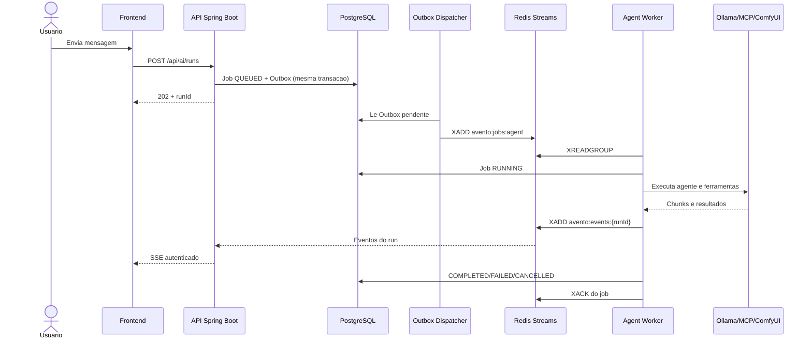

# Execucao assincrona com Redis

Este guia explica, passo a passo, por que o Avento usa PostgreSQL, Redis Streams, Outbox, worker e
SSE no mesmo fluxo. Ele descreve o codigo atual, nao apenas uma arquitetura desejada.

## O problema resolvido

Antes desta mudanca, o navegador mantinha aberto o mesmo `POST /api/ai/stream` que executava o
agente. Fechar o request podia separar a interface da execucao, imagem bloqueava a resposta enquanto
o ComfyUI trabalhava e o contexto completo era reenviado pelo frontend a cada mensagem.

Agora o envio e a observacao sao operacoes diferentes:

1. o frontend salva a mensagem no chat;
2. `POST /api/ai/runs` grava um job e uma Outbox no PostgreSQL;
3. o dispatcher publica somente a referencia do job em `avento:jobs:agent`;
4. o worker le o payload duravel no PostgreSQL e executa o agente;
5. cada chunk e evento e publicado em `avento:events:{runId}`;
6. `GET /api/ai/runs/{runId}/events` entrega esses eventos ao navegador por SSE;
7. o resultado final continua sendo salvo como mensagem pelo fluxo normal do chat.



## Por que existem PostgreSQL e Redis

O PostgreSQL e a fonte de verdade. Ele guarda chats, mensagens, jobs e a Outbox. Reiniciar ou
limpar o Redis nao pode apagar uma conversa.

O Redis cuida do trabalho temporario e rapido:

| Chave | Responsabilidade |
|---|---|
| `avento:jobs:agent` | fila dos jobs do agente |
| `avento:events:{runId}` | texto, thinking, ferramentas, aprovacoes e ciclo de um unico run |
| `avento:dead-letter` | jobs que terminaram com falha tecnica |
| `avento:context:{userId}:{chatId}` | cache das mensagens recentes do chat |
| `avento:*` do Vector Store | embeddings e chunks do RAG |

Imagens, videos, PDF, audio e base64 nao sao gravados nos Streams. O request completo fica no job
do PostgreSQL apenas enquanto e necessario e e substituido por `{}` ao terminar, falhar, cancelar ou
aguardar aprovacao.

## Onde cada parte esta no codigo

| Responsabilidade | Arquivo principal |
|---|---|
| Configuracao e nomes dos Streams | `back/avento/src/main/java/com/avento/config/RedisExecutionProperties.java` |
| Job duravel e estados | `back/avento/src/main/java/com/avento/model/AgentRunJob.java` |
| Registro transacional da Outbox | `back/avento/src/main/java/com/avento/model/ExecutionOutboxEvent.java` |
| Criacao, cancelamento e recuperacao dos jobs | `back/avento/src/main/java/com/avento/service/execution/AgentRunSubmissionService.java` |
| Publicacao da Outbox no Redis | `back/avento/src/main/java/com/avento/service/execution/RedisOutboxDispatcher.java` |
| Consumo e execucao do agente | `back/avento/src/main/java/com/avento/service/execution/AgentRunWorker.java` |
| Publicacao dos eventos do agente | `back/avento/src/main/java/com/avento/service/execution/RedisRunEventPublisher.java` |
| Redis Streams para SSE | `back/avento/src/main/java/com/avento/service/execution/RunEventStreamService.java` |
| Cache reconstruivel da conversa | `back/avento/src/main/java/com/avento/service/context/ConversationContextCache.java` |
| Rotas HTTP autenticadas | `back/avento/src/main/java/com/avento/controller/LocalAiOrchestratorController.java` |
| Envio Axios, leitura SSE e cancelamento | `front/src/hooks/useChatStream.ts` |

As tabelas e os indices sao criados pelo Hibernate no ambiente local atual. Antes de distribuir o
Avento para outras maquinas, esse passo deve migrar para Flyway ou Liquibase para manter o schema
versionado e repetivel.

## Outbox sem salto perdido

Salvar um job no banco e publicar no Redis sao duas operacoes diferentes. Se o processo parasse
entre elas, o job poderia existir sem nunca chegar ao worker. Por isso `AgentRunSubmissionService`
grava `AgentRunJob` e `ExecutionOutboxEvent` na mesma transacao.

`RedisOutboxDispatcher` tenta publicar as Outboxes pendentes a cada 250 ms. Ele so preenche
`publishedAt` depois que `XADD` funciona. Se Redis estiver fora do ar, a linha permanece pendente.
Outboxes publicadas sao removidas depois de um dia.

Esta estrategia entrega **pelo menos uma vez**, nao exatamente uma vez. Uma referencia pode ser
publicada novamente depois de uma falha. O worker consulta o status duravel e ignora jobs que ja
estao em estado terminal antes de executar.

## Consumer group e confirmacao

`AgentRunWorker` participa do consumer group `avento-agent-workers`. Ele confirma uma entrada com
`XACK` somente depois de atualizar o estado duravel do job. O worker atual e unico por instancia e
processa um job por vez, adequado ao hardware local e aos modelos pesados.

Antes de executar, o worker faz um claim atomico no PostgreSQL: o `UPDATE` so muda o job de
`QUEUED` para `RUNNING` se ele ainda estiver na fila. Reinicios podem republicar uma Outbox para
garantir recuperacao, mas duas entradas Redis para o mesmo job nao criam duas execucoes nem dois
pedidos de aprovacao; somente a primeira consegue o claim e as demais recebem `XACK` sem executar.

Na subida, jobs `QUEUED` ou interrompidos em `RUNNING` recebem uma nova Outbox. Jobs que aguardavam
aprovacao sao marcados como falha porque a continuacao da ferramenta ainda vive em memoria e nao
pode ser reconstruida com seguranca depois de reiniciar o backend.

Recuperar automaticamente entradas pendentes de um consumer morto com `XAUTOCLAIM` ainda e uma
etapa futura. A republicacao duravel permite retomar o trabalho hoje, enquanto a entrada antiga e
ignorada quando encontrada porque o job ja terminou.

## Contexto da conversa

O navegador ainda envia o ultimo pedido enriquecido com anexos e contexto visual. O backend nao
confia mais no array inteiro como historico canonico:

1. procura `avento:context:{userId}:{chatId}`;
2. se nao existir, carrega as mensagens do PostgreSQL;
3. limita a janela recente pelo valor configurado;
4. substitui a ultima mensagem canonica pela versao enriquecida do pedido atual;
5. entrega o resultado ao agente;
6. atualiza ou invalida o cache quando mensagens mudam ou o chat e apagado.

O TTL padrao e 24 horas e a janela padrao e de 20 mensagens. Redis indisponivel causa apenas um
cache miss; o PostgreSQL reconstrui o contexto.

Resumo incremental das mensagens antigas ainda nao foi implementado. O limite atual evita contexto
sem controle, e o resumo entrara antes de ampliar a janela para conversas muito longas.

## Isolamento e reconexao

Cada evento carrega `userId`, `chatId`, `runId`, tipo, horario e payload original. O endpoint SSE
confere o proprietario do job antes de abrir o stream e entrega somente eventos cujo `userId` e
`runId` correspondem ao usuario autenticado.

Cada run possui seu proprio Stream. Assim uma conversa nova nao precisa reler milhares de deltas de
runs antigos para encontrar os seus eventos. O TTL padrao e 24 horas e e renovado no evento
terminal; PostgreSQL continua sendo a fonte duravel da conversa e do estado do job.

O Redis gera o `id` de cada entrada. O navegador pode enviar `Last-Event-ID` ao reconectar para
continuar depois do ultimo evento recebido. O stream encerra em conclusao, falha, cancelamento ou
pedido de aprovacao. A aprovacao usa a rota existente e continua o mesmo `runId`.

Durante um replay, `tool.approval.required` e comparado com a timeline persistida e o estado do job.
Pedidos pertencentes a runs terminais ou que ja tenham evento `accepted`, `rejected` ou
`superseded` sao ignorados, permitindo que o leitor alcance os eventos posteriores. Resolver uma
aprovacao tambem invalida eventuais aprovacoes irmas do mesmo `runId`, protegendo contra registros
duplicados criados por uma versao anterior.

Ao abrir uma conversa, o frontend consulta `GET /api/ai/runs/active/{chatId}`. O endpoint le
`agent_run_jobs`, e nao o registro em memoria do processo Java. Se houver um run ativo, a tela
restaura imediatamente o indicador de processamento e reconecta ao Stream daquele `runId`; eventos
anteriores reconstroem o texto parcial. Se a pagina foi recarregada, a resposta recuperada tambem e
persistida quando o evento terminal chegar.

Jobs de imagem sao restaurados separadamente por `GET /api/images/chat/{chatId}`. Isso permite
mostrar novamente o cartao, progresso e resultado mesmo quando o marcador textual da ferramenta
ainda nao tinha sido salvo na conversa. Uma falha temporaria nessa consulta usa backoff e nao deixa
o cartao parado silenciosamente em `Carregando`.

O worker do agente aplica dois watchdogs. `run-timeout` limita a execucao completa a 15 minutos e
`run-inactivity-timeout` encerra em 6 minutos quando nenhum token, evento ou progresso e observado.
Esse valor foi ampliado de 3 para 6 minutos porque rodadas com muitas ferramentas selecionadas (MCP
externo incluido) podem legitimamente levar mais de 3 minutos para produzir o primeiro sinal de
progresso em hardware local, sem que isso signifique uma trava real.
O segundo watchdog e independente da cadeia reativa do modelo: mesmo que um request interno deixe
de propagar seu timeout, o `CountDownLatch` do worker nao fica bloqueado para sempre. Ao expirar, o
job vira `FAILED`, um evento terminal fecha o SSE e o worker segue para o proximo item da fila.

O cancelamento tambem alcanca a requisicao em andamento no Ollama. As rodadas 2+ do agente sao
subscriptions filhas registradas em um composite por execucao; descartar a run descarta a cadeia
inteira, abortando o HTTP da rodada atual. Sem isso, uma run encerrada pelo watchdog deixava a
requisicao viva no Ollama indefinidamente, ocupando a GPU e enfileirando todos os pedidos
seguintes — o sintoma visivel era o chat "sem feedback" e cada vez mais lento.

Quando o backend ja injetou `[Project Analysis]`, uma resposta textual completa encerra a rodada.
Ela nao e descartada para repetir automaticamente o pedido com todas as ferramentas MCP, evitando
contexto excessivo, processos desnecessarios e uma segunda rodada sem progresso.

## Cancelamento

`POST /api/ai/runs/{runId}/cancel` faz quatro coisas:

1. confere que o run pertence ao usuario autenticado;
2. grava `CANCEL_REQUESTED` no PostgreSQL;
3. descarta a subscription ativa do worker;
4. publica `agent.run.cancelled` para encerrar a interface.

O encadeamento reativo do `AgentService` agora liga o cancelamento externo aos requests internos do
Ollama, inclusive quando uma nova rodada do modelo foi iniciada.

## Exclusao do chat

Ao apagar um chat, o backend tambem cancela runs ativos, remove jobs do agente, apaga Outboxes
relacionadas e remove o cache de contexto. Entradas que ja estavam na fila podem continuar no Redis
por pouco tempo, mas o worker nao encontra mais o job e apenas confirma a entrada sem executar.

## Configuracao

```yaml
avento:
  execution:
    redis:
      enabled: true
      event-stream: avento:events
      agent-job-stream: avento:jobs:agent
      dead-letter-stream: avento:dead-letter
      agent-consumer-group: avento-agent-workers
      event-max-length: 50000
      event-block-timeout: 2s
      run-timeout: 15m
      run-inactivity-timeout: 6m
      event-ttl: 24h
      context-ttl: 24h
      context-message-limit: 20

spring:
  data:
    redis:
      client-type: jedis
      host: 127.0.0.1
      port: 6379
      timeout: 2s
```

Todas as propriedades possuem equivalente `AVENTO_REDIS_*` em `application.yml`.

O `client-type` precisa permanecer como `jedis` enquanto o projeto usar Spring AI `1.1.8`.
Nessa versao, a autoconfiguracao do Redis Vector Store exige especificamente um
`JedisConnectionFactory`; com o Lettuce padrao do Spring Boot, o bean `VectorStore` nao e criado e o
backend falha antes de subir. Filas, eventos e contexto continuam usando `StringRedisTemplate`
normalmente sobre a mesma conexao Jedis.

## Como inspecionar

Com o ambiente iniciado pelo `scripts/dev-up.sh`:

```bash
docker exec avento-redis-stack redis-cli XLEN avento:jobs:agent
docker exec avento-redis-stack redis-cli XINFO GROUPS avento:jobs:agent
docker exec avento-redis-stack redis-cli --scan --pattern 'avento:events:*'
docker exec avento-redis-stack redis-cli XRANGE avento:events:run_EXEMPLO - + COUNT 10
docker exec avento-redis-stack redis-cli XRANGE avento:dead-letter - + COUNT 10
docker exec avento-redis-stack redis-cli --scan --pattern 'avento:context:*'
```

Para verificar Outbox e jobs no PostgreSQL:

```sql
select run_id, status, attempts, created_at, completed_at
from agent_run_jobs
order by id desc
limit 20;

select id, aggregate_id, attempts, published_at, last_error
from execution_outbox_events
order by id desc
limit 20;
```

## Falhas comuns

### Job fica em `QUEUED`

Confira Redis, Outbox e consumer group. `published_at` nulo com `last_error` indica falha entre o
dispatcher e Redis. `published_at` preenchido sem consumo pede inspecao de `XINFO GROUPS`.

Se existir um job antigo em `RUNNING`, confira o log do worker. Depois da atualizacao, toda execucao
e encerrada pelo `run-timeout`; o valor pode ser ajustado por `AVENTO_REDIS_RUN_TIMEOUT`, por exemplo
`10m` ou `30m`.

### Frontend conecta, mas nao recebe eventos

Confira se `avento:events:{runId}` existe e se o `userId` do evento corresponde ao cookie
autenticado. O endpoint retorna `404` quando o run nao pertence ao usuario.

### Redis reiniciou

O contexto recente e reconstruido do PostgreSQL. Outboxes nao publicadas voltam a ser tentadas e
jobs interrompidos sao reenfileirados na subida do backend.

## Proximas etapas

- usar `XAUTOCLAIM` para limpar e assumir pendencias de consumers mortos;
- agrupar deltas do modelo em janelas de 50 a 100 ms antes de `XADD`;
- criar resumo incremental duravel para conversas longas;
- generalizar `AgentRunJob` em jobs de imagem, video e voz;
- persistir a continuacao de aprovacoes para sobreviver ao reinicio;
- trocar `ddl-auto:update` por migrations versionadas antes de distribuicao remota.
